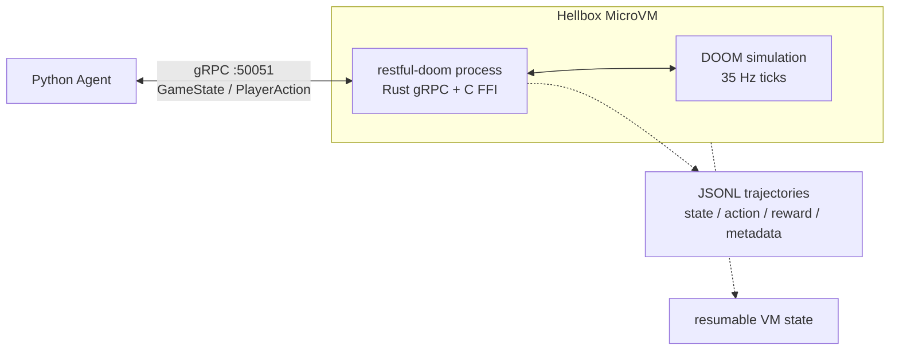

# RESTful-DOOM Agent Mode

This fork turns DOOM into a deterministic, inspectable, remotely hosted agent
environment. A protobuf + gRPC bridge runs inside the Doom process, publishes
structured state every simulated tic, and accepts actions over a bidirectional
observe-act stream.

The original HTTP + JSON REST API is still here. The new path is the agent
capsule: headless RESTful-DOOM inside a Hellbox/Shrink MicroVM, reachable over
short-lived authenticated gRPC, with JSONL trajectories for replay and evals.

## Why This Exists

Hellbox's human-facing demo is a playable cloud microVM arcade: stream DOOM to a
browser, freeze the VM mid-fight, thaw it, and keep playing. This repo is the
machine-facing companion demo:

| Demo | Interface | Audience | Hook |
| --- | --- | --- | --- |
| Playable DOOM capsule | Browser video/audio/input | Humans, launch demos | Freeze a live game mid-fight |
| Agent DOOM capsule | gRPC structured state/actions | Agents, evals, sandboxing | Freeze a policy rollout and resume the same simulation |

The punchline is:

> Freeze an AI agent's game environment mid-policy rollout, thaw it later, and
> continue from the same simulation state.

## Current Status

- Protobuf/gRPC observe-act loop runs inside Doom.
- Headless Hellbox/Shrink capsule exposes authenticated gRPC.
- Deterministic structured brain has completed E1M1 with multiple kills.
- Behavior-cloned skill selector is trained from a successful trajectory, but
  this is supervised imitation rather than independent RL.
- PPO can learn kills from a hand-placed combat-start reset, but not yet from
  normal spawn.
- Snapshot-backed curriculum contracts, manifest builder, artifact validator,
  PPO restore plumbing, and native agent save-slot restore are implemented.
- Snapshot PPO summaries distinguish earned kill progress from absolute kill
  counters inherited from restored slots.
- Post-combat exit-routing diagnostics track controller-selected exit-line
  attempts/progress, while `post-combat-exit-route` snapshots now require an
  actual exit route waypoint rather than exit-control fallback evidence.
- Checkpoint curriculum eval restores snapshot stages through the same native
  slot/external restore path and serializes start-vs-earned counters.
- Checkpoint scorer schema `restfuldoom.ppo_checkpoint_eval_score.v5` scores
  true-spawn stages through the `true_spawn_e2e_gate` report, while keeping
  required-kill, completed-exit, and post-combat exit-routing objectives
  separate with shaped reward capped as a tiebreaker.
- Full independent PPO level completion from E1M1 spawn is not proven yet.
- Next major unlock: capture real Hellbox/Shrink progressed-map snapshots and
  train/evaluate PPO through the promotion gate.

## Architecture



## Fork Delta

This repo is a derivative of the original RESTful-DOOM and Chocolate Doom
lineage. The fork keeps the original HTTP + JSON API and adds:

- protobuf schema for agent-focused game state and actions
- Rust `tonic` gRPC server linked into the Doom binary as a static library
- C/Rust FFI bridge that publishes state after each `G_Ticker()` and overlays queued actions into `ticcmd`
- Python async client, deterministic smoke agent, reward scoring, Bedrock policy hook, and JSONL trajectory logging
- config-driven rollout goals, authenticated gRPC metadata, reconnect handling, and trajectory diagnostics
- Hellbox-style headless capsule packaging for a MicroVM-ready agent environment

## Original REST API Lineage

The original RESTful-DOOM premise is still preserved: an HTTP + JSON API hosted
inside the 1993 DOOM engine.


The original API allows external clients to query and manipulate game objects
while the game runs. It was built on top of
[Chocolate Doom](https://github.com/chocolate-doom/chocolate-doom), which keeps
the engine close to the original experience while making it easier to build on
modern systems.

Original blog post:
http://1amstudios.com/2017/08/01/restful-doom/

Original RAML API spec:

[API spec in RAML 1.0 format](https://github.com/jeff-1amstudios/restful-doom/blob/master/RAML/doom.raml)

## Build

### Building dependencies (needs to be run only once)

Takes care of building and configuring dependencies like SDL. Uses [chocpkg](https://github.com/chocolate-doom/chocpkg).
```
./configure-and-build.sh
```

### Compiling

Run `make` from the src (or root) directory. `src/restful-doom` will be created if the compile succeeds.

## Run

The DOOM engine is open source, but assets (art, maps etc) are not. You'll need to download an appropriate [WAD file](https://en.wikipedia.org/wiki/Doom_WAD) separately.

To run restful-doom on port 6666:
```
src/restful-doom -iwad <path/to/doom1.wad> -apiport 6666 ...
```

## gRPC API Details

RESTful-DOOM also includes a high-performance protobuf + gRPC bridge for AI agents. The
bridge runs inside the Doom process, publishes structured state after every simulated tic, and
accepts player actions over a bidirectional stream.

The shared schema lives at:

```
proto/restfuldoom/v1/agent.proto
```

Run Doom with the agent bridge on the default gRPC port:

```
src/restful-doom -iwad <path/to/doom1.wad> -warp 1 1 -skill 3 -agent
```

Or choose a port explicitly:

```
src/restful-doom -iwad <path/to/doom1.wad> -warp 1 1 -skill 3 -agentport 50051
```

The stream service is:

```
restfuldoom.v1.DoomAgent/GameSession
```

It returns `GameState` messages containing player state, enemy state, useful map objects,
level progress, and optional per-client `StateDelta` payloads. Actions can be high-level
semantic commands such as `ACTION_FORWARD` and `ACTION_SHOOT`, or exact raw `ticcmd` overlays
for low-level policies.

### Python Agent

Generate Python protobuf stubs and run the deterministic smoke agent:

```
cd agent
python -m pip install -r requirements.txt
PYTHONPATH=. python -m restfuldoom_agent.generate_stubs
PYTHONPATH=. python -m restfuldoom_agent.smoke_agent --endpoint 127.0.0.1:50051
```

Add `--trajectory-jsonl trajectories/run.jsonl` to the smoke agent to persist
state/action/reward records for replay or training analysis.
Use `--goal-preset survival|navigation|combat|item_collection|exit_seeking` to
switch reward shaping, and leave reconnect enabled for Hellbox demos so stderr
reports the gRPC status, backoff delay, and last observed Doom tick.

For repeatable demos, pass a rollout JSON config. CLI flags override values in
the file:

```
PYTHONPATH=. python -m restfuldoom_agent.smoke_agent \
    --config examples/hellbox-rollout.json \
    --endpoint 127.0.0.1:50051
```

The Python package includes:

- async gRPC client helpers
- streaming rollout API with reconnect/backoff and last-seen-tick reporting
- a deterministic smoke policy
- a structured local brain with tactical memory, skill selection, and policy evolution
- named goal/reward presets
- optional nonblocking AWS Bedrock text-reasoning policy
- JSONL trajectory logging
- JSON rollout config for goal injection, auth metadata, and demo budgets

### Structured Local Brain

The practical agent path is not an LLM pressing controls every tic. The fast
player is a local process that consumes protobuf `GameState`, chooses a small
skill, and sends `PlayerAction` back over gRPC. Codex or another LLM can then
act as the training operator: inspect failures, adjust goals/rewards, and
promote better policies.

For the concrete boundary between the fast controller, learned decision layer,
memory file, skill action space, and PPO observation vector, see
`docs/agent-training-interface.md`, `docs/agent-learning-architecture.md`, and
`docs/agent-runtime-contracts.md`. The same contracts are exported in
trajectory/checkpoint metadata as
`restfuldoom.decision_cycle.v1`,
`restfuldoom.agent_memory_contract.v1`, `restfuldoom.observation.v1`, and
`restfuldoom.skill_action.v1`.

Run the first trainable brain against a local Doom gRPC endpoint:

```
PYTHONPATH=agent python -m restfuldoom_agent.brain_agent \
    --endpoint 127.0.0.1:50051 \
    --goal-preset combat \
    --max-states 700 \
    --evolve-runs 3 \
    --memory-path agent_memory/e1m1.json \
    --trajectory-jsonl trajectories/brain.jsonl
```

The brain persists cross-run memory in `agent_memory/e1m1.json`: visited map
cells, enemy sightings, lessons from deaths/kills, and the best promoted
policy parameters. Each evolution run mutates the current best parameters,
scores the real rollout with the selected reward preset, and promotes the
candidate when its fitness beats the stored baseline.

The gRPC stream includes a compact `NavigationProbe` so the brain can avoid
video latency and REST map queries. Each state reports whether forward/back/side
movement is locally open, whether a usable line is ahead, and the distance to
the front blocking line. The local policy uses this to open doors, sidestep, or
turn away from blocked geometry while hunting enemies from protobuf state.

The default success target is intentionally concrete: complete a level and score
at least one kill in the same autonomous run. Until that happens, the training
job is still in progress even if fitness improves.

The Codex MCP server exposes the same path through `brain_drive` and
`brain_memory`, so Codex can run a goal, inspect memory, adjust rewards, and
iterate without relying on screenshots for control.

Train the learned decision layer from successful trajectory records:

```
PYTHONPATH=agent python -m restfuldoom_agent.brain_agent \
    --memory-path agent_memory/e1m1.json \
    --train-skill-model agent_models/skill-policy.json \
    --skill-model-trajectory trajectories/brain-train-68-current-success.jsonl
```

This writes a `restfuldoom.skill_policy.v1` JSON checkpoint. The current model
is a dependency-light softmax classifier over compact protobuf features; it
learns which high-level skill the structured brain selected, while the
deterministic controller still owns tic-level movement, aiming, firing, and
door use. Pass `--skill-model-path agent_models/skill-policy.json` during a
rollout to attach learned skill predictions to trajectory metadata.

Export the current training job before moving from Docker to cloud:

```
PYTHONPATH=agent python -m restfuldoom_agent.brain_agent \
    --memory-path agent_memory/e1m1.json \
    --export-job training-jobs/restfuldoom-agent-training.tar.gz
```

The bundle uses schema `restfuldoom.training_job.v1` and includes a manifest,
memory, promoted parameters, `agent-notes.md`, learned model checkpoints, and
referenced JSONL trajectories. When PPO checkpoints exist in memory, the same
bundle also includes `agent_models/ppo/*.pt`, optimizer state, observation
schema, action schema, reward config, eval history, referenced PPO rollout
buffers, and the best PPO resume candidate recorded in `ppo_best_checkpoint`.
Import rewrites extracted memory paths to the destination-local checkpoints,
buffers, trajectories, and snapshot artifacts so a cloud worker can continue
training against a new gRPC endpoint. Native `save_slot:N` curricula are
reported as unbundled in the manifest unless their underlying savegame bytes
are exported separately; those slots are portable only on the originating Doom
server for now:

```
PYTHONPATH=agent python -m restfuldoom_agent.brain_agent \
    --import-job training-jobs/restfuldoom-agent-training.tar.gz \
    --import-destination .
```

### PPO Skill Learning

Full RL uses the protobuf state stream directly. The agent first learns to
choose high-level skills while the deterministic controller still handles
tic-level movement, aiming, firing, and door use. This keeps the first PPO
target tractable and avoids screenshot latency.

The training API is:

- `ResetEpisode` queues a fast in-process reset on Doom's simulation thread.
- `DoomAgentEnv.reset()` calls that reset and returns a compact feature vector.
- `DoomAgentEnv.step(action)` sends one PPO-selected skill action and returns
  `(observation, reward, done, info)`.
- PPO samples under action masks derived from protobuf combat/navigation
  affordances, and the update recomputes logprobs under the same masks.
- `--bc-trajectory` can warm-start the PPO actor from successful protobuf
  trajectory decisions before live reward updates.
- `--reset-warmup-*` can run bounded heuristic curriculum warmup before PPO
  collection starts, with warmup tics and stop reasons reported in rollout
  summaries.
- `--reset-start-*` can request a fresh-reset curriculum start: position,
  facing, health, armor, and ammo are applied inside Doom before the first
  training observation is published.
- `--reset-timeout-seconds` and `--reset-attempts` harden long PPO runs against
  a missed reset observation.
- `--resume-checkpoint` continues PPO from a saved `.pt` checkpoint, including
  model weights and optimizer state.
- `--resume-best-checkpoint` continues PPO from `ppo_best_checkpoint` in
  `--memory-path`, which is useful when the latest curriculum update regressed
  but an earlier update in the same lineage had better rollout evidence.
- `--checkpoint-eval-curriculum` evaluates each saved checkpoint across every
  active curriculum stage and uses the aggregate cross-stage score for
  `ppo_best_checkpoint`. This is slower than rollout-only selection, but it
  helps avoid preserving a checkpoint that overfit one contact stage while
  regressing combat-start or another visible-contact start.
- `--eval-checkpoint --checkpoint-eval-curriculum` runs the same cross-stage
  curriculum eval without taking another training update.
- `--allowed-skill <skill>` is an experiment-only allowlist applied after the
  normal action mask. It can narrow probes to ladders such as
  `close_visible_contact` plus `fire`, but it never makes a masked-out skill
  feasible.
- `--rollout-stage-mix round_robin|random` can rotate curriculum stages between
  episode resets inside one PPO rollout buffer. Pair it with
  `--rollout-stage-segment-tics <n>` for short experiments that need multiple
  reset starts in the same update. Stage switches happen only at `done=True`
  boundaries so GAE does not leak across unrelated starts.
- `restfuldoom_agent.ppo` provides actor-critic PPO, GAE, clipped objective,
  entropy bonus, rollout JSONL buffers, checkpoint save/load, and a promotion
  gate.
- Combat rewards include enemy damage deltas from protobuf enemy health, so PPO
  can receive feedback before a full kill lands. They also include nearest-enemy
  distance progress from protobuf enemy distances, so early policies get
  navigation signal before line of sight.
- PPO observations include current-sector hazard fields and a cheap progression
  route waypoint from protobuf navigation, giving spawn-to-contact training
  more than nearest-enemy distance alone.
- PPO macro-action history also records route-progression outcomes: distance
  gained toward the waypoint, reached/failed flags, and failed-attempt streaks.
  This lets the model distinguish a useful navigation choice from a repeated
  stall.
- PPO observations also include bounded temporal context: recent movement
  delta, enemy-distance trend, route-distance trend, same-cell streak, recent
  visible/shootable contact, and rolling route failure/progress signals.
- PPO observations append explicit contact-context fields for the current or
  remembered visible-contact use line: active flag, distance, angle, close-use
  readiness, bounded follow-through state, and age.
- PPO observations also append local topology context from projected direction
  probes and AgentMemory cell visits: current-cell revisit pressure, least-
  visited open-neighbor direction, and open-cell exhaustion ratio. This is a
  compact spawn-to-contact signal, not a full map graph.
- PPO observations append visible-contact geometry for the current line-of-sight
  enemy: active/shootable/needs-closure flags, distance, angle, alignment, and
  close-contact state. This makes the first-visible to first-shootable subtask
  explicit in the vector instead of hiding it in generic enemy memory.
- PPO exposes `close_visible_contact` as its own stable skill action. Visible
  but not shootable contact now has a direct contact-closing option, while
  `open_use_line` is masked during far contact unless the line is close/use-
  ready or the enemy contact is close and aligned enough to make using the line
  plausible.
- `--first-visible-bonus`, `--first-shootable-bonus`,
  `--visible-contact-progress-reward`, `--terminate-on-first-visible`, and
  `--terminate-on-first-shootable` enable first-contact and
  contact-to-shootable curricula. This trains route-to-first-combat and
  visible-contact closing separately without weakening the promotion gate for
  full-level completion and kills.
- Checkpoints and rollout buffers carry `restfuldoom.observation.v1` and
  `restfuldoom.skill_action.v1`, including feature descriptors and
  machine-readable definitions for each PPO skill.
- Rollout buffers and checkpoints also carry the decision-cycle and memory
  contracts, so a resumed cloud job can inspect how skills, masks, memory
  queries, and controller execution are meant to interact.
- Older PPO checkpoints can resume when observation features are appended and
  the saved action schema matches the current action prefix exactly. Observation
  weights are expanded with zero-initialized new columns; appended actor actions
  get initialized rows. Reordered or renamed existing actions are rejected so
  old logits cannot silently map to different skills.

Run a small PPO batch against a live gRPC Doom endpoint:

```
PYTHONPATH=agent python -m restfuldoom_agent.ppo_agent \
    --endpoint 127.0.0.1:50051 \
    --goal-preset combat \
    --updates 1 \
    --rollout-steps 512 \
    --checkpoint-dir agent_models/ppo \
    --buffer-dir trajectories/ppo \
    --memory-path agent_memory/e1m1.json
```

Warm-start from a known successful trajectory:

```
PYTHONPATH=agent python -m restfuldoom_agent.ppo_agent \
    --endpoint 127.0.0.1:50051 \
    --goal-preset combat \
    --updates 5 \
    --rollout-steps 256 \
    --bc-trajectory trajectories/brain-train-68-current-success.jsonl \
    --bc-epochs 6 \
    --checkpoint-dir agent_models/ppo \
    --buffer-dir trajectories/ppo \
    --memory-path agent_memory/e1m1.json
```

Fresh combat-start curriculum is available for fast PPO experiments:

```
PYTHONPATH=agent python -m restfuldoom_agent.ppo_agent \
    --endpoint 127.0.0.1:50051 \
    --goal-preset combat \
    --updates 8 \
    --rollout-steps 128 \
    --checkpoint-dir agent_models/ppo \
    --buffer-dir trajectories/ppo \
    --memory-path agent_memory/e1m1.json \
    --reset-start-x-fp 212860928 \
    --reset-start-y-fp -214958080 \
    --reset-start-face-nearest-enemy \
    --reset-start-health 100 \
    --reset-start-ammo-bullets 50
```

A named reset-start curriculum can rotate from proven combat starts back toward
normal spawn-to-contact navigation without restarting Docker:

```
PYTHONPATH=agent python -m restfuldoom_agent.ppo_agent \
    --endpoint 127.0.0.1:50051 \
    --goal-preset navigation \
    --updates 8 \
    --rollout-steps 128 \
    --checkpoint-dir agent_models/ppo \
    --buffer-dir trajectories/ppo \
    --memory-path agent_memory/e1m1.json \
    --resume-checkpoint agent_models/ppo/ppo-tight-mask-independent-combat-start-smoke-ppo-0007.pt \
    --curriculum e1m1-spawn-to-combat \
    --curriculum-mode round_robin
```

The current `e1m1-spawn-to-combat` stages are fresh-level `EpisodeStart`
teleports ordered from easiest to hardest: three live-validated combat starts
with immediate enemy affordances, then real E1M1 spawn. Each rollout row and
checkpoint records the active `restfuldoom.ppo_curriculum.v1` stage, including
validation evidence for the reset start. Trajectory-derived first-contact
coordinates are intentionally not in this curriculum because a fresh
`ResetEpisode` does not restore opened doors, enemy movement, or other
progressed-map mutations.

`e1m1-contact-to-combat` is a second named curriculum for the current
contact-to-shootable bottleneck. It rotates through fresh-reset positions that
start with a visible enemy but no shootable target, then bridges back to the
known shootable `combat_start`. Use it with `--first-shootable-bonus` and
`--terminate-on-first-shootable` to train the contact boundary directly. Add
`--visible-contact-progress-reward` when the learner needs dense feedback for
closing distance to a visible but not yet shootable enemy. The visible-contact
controller uses short graded movement rays, remembered contact corridors, and
short-lived contact use-line memory; the PPO mask keeps this boundary focused
on `close_visible_contact`, `seek_enemy`, and ready usable-line affordances
instead of generic route progression or far `open_use_line` overcommit. The
observation vector now exposes that contact use-line state directly, so PPO can
distinguish a fresh contact candidate from a stale or over-forced line. Use
`--curriculum-mode fixed --curriculum-start-index <n>` when a single stage needs
repeated training before mixing it back into the schedule.

Before spending more PPO updates on a contact-stage failure, run a forced-option
micro-eval from the same restored stage. This checks whether a primitive can
deterministically turn first-visible contact into first-shootable contact, and
reports mask validity, decision-skill counts, visible-contact loss,
enemy-distance delta, contact-line close steps, first-shootable contacts,
damage, and earned kills.

```
PYTHONPATH=agent python -m restfuldoom_agent.forced_option_eval \
    --endpoint 127.0.0.1:50051 \
    --snapshot-curriculum trajectories/e1m1-snapshot-curriculum.json \
    --stage-index 0 \
    --force-skill close_visible_contact \
    --force-skill seek_enemy \
    --force-skill open_use_line \
    --macro-steps 128 \
    --max-steps 512 \
    --output trajectories/forced-option-report.json \
    --jsonl trajectories/forced-option-records.jsonl
```

When the forced primitive reaches a shootable state, add a handoff skill to test
the full bridge. If `close_visible_contact` becomes disallowed because `fire` is
now legal, the report classifies that stop as
`forced_option_completed_shootable`; selected invalid-action counts remain
separate from expected forced-option completion.

```
PYTHONPATH=agent python -m restfuldoom_agent.forced_option_eval \
    --endpoint 127.0.0.1:50051 \
    --snapshot-curriculum trajectories/e1m1-snapshot-curriculum.json \
    --stage-index 0 \
    --force-skill close_visible_contact \
    --shootable-handoff-skill fire \
    --macro-steps 160 \
    --max-steps 640
```

For PPO ladder probes, constrain the action surface before mixing broader
curricula back in:

```
PYTHONPATH=agent python -m restfuldoom_agent.ppo_agent \
    --endpoint 127.0.0.1:50051 \
    --snapshot-curriculum trajectories/e1m1-snapshot-curriculum.json \
    --curriculum-mode fixed \
    --curriculum-start-index 0 \
    --resume-checkpoint agent_models/ppo/contact-checkpoint.pt \
    --allowed-skill close_visible_contact \
    --allowed-skill seek_enemy \
    --allowed-skill fire \
    --updates 2 \
    --rollout-steps 192 \
    --max-steps 640 \
    --checkpoint-eval-curriculum
```

For longer curriculum runs, add `--checkpoint-eval-curriculum` with small
`--checkpoint-eval-max-steps` first. The eval result is stored in checkpoint
extras, training output, and memory as
`restfuldoom.ppo_checkpoint_curriculum_eval.v1`; best-checkpoint selection then
uses the cross-stage score instead of only the active rollout's local reward.
Because those scores are not on the same scale, the first curriculum-evaluated
checkpoint intentionally starts a new best-checkpoint comparison lineage over
older rollout-only bests.

```
PYTHONPATH=agent python -m restfuldoom_agent.ppo_agent \
    --endpoint 127.0.0.1:50051 \
    --goal-preset navigation \
    --updates 4 \
    --rollout-steps 256 \
    --checkpoint-dir agent_models/ppo \
    --buffer-dir trajectories/ppo \
    --memory-path agent_memory/e1m1.json \
    --resume-checkpoint agent_models/ppo/ppo-tight-mask-independent-combat-start-smoke-ppo-0007.pt \
    --curriculum e1m1-contact-to-combat \
    --curriculum-mode round_robin \
    --first-shootable-bonus 20 \
    --visible-contact-progress-reward 0.01 \
    --terminate-on-first-shootable \
    --checkpoint-eval-curriculum \
    --checkpoint-eval-max-steps 128
```

For short contact-curriculum probes, mix stages within each PPO buffer so one
update sees the visible-contact variants and the combat bridge before the
checkpoint is scored:

```
PYTHONPATH=agent python -m restfuldoom_agent.ppo_agent \
    --endpoint 127.0.0.1:50051 \
    --goal-preset navigation \
    --updates 2 \
    --rollout-steps 128 \
    --checkpoint-dir agent_models/ppo \
    --buffer-dir trajectories/ppo \
    --memory-path agent_memory/e1m1.json \
    --resume-best-checkpoint \
    --curriculum e1m1-contact-to-combat \
    --curriculum-mode round_robin \
    --rollout-stage-mix round_robin \
    --rollout-stage-segment-tics 64 \
    --first-shootable-bonus 20 \
    --visible-contact-progress-reward 0.01
```

After a true-spawn gate failure classified as `first_contact`, use
`e1m1-true-spawn-contact-bridge`. It keeps real `fresh_spawn` in the training
mix, adds the visible-contact starts that isolate the contact-to-shootable
boundary, and keeps the known shootable combat start as the bridge target. This
is still bottleneck training: promote only with `true_spawn_e2e_gate`, then
rerun the restored contact/post-combat gates to catch regressions.

```
PYTHONPATH=agent python -m restfuldoom_agent.ppo_agent \
    --endpoint 127.0.0.1:50051 \
    --goal-preset navigation \
    --run-id ppo-true-spawn-contact-bridge \
    --updates 2 \
    --rollout-steps 512 \
    --max-steps 640 \
    --checkpoint-dir agent_models/ppo \
    --buffer-dir trajectories/ppo \
    --memory-path agent_memory/e1m1.json \
    --resume-checkpoint agent_models/ppo/ppo-postcombat2-exitshape-wave3-20260627-a-ppo-0001.pt \
    --curriculum e1m1-true-spawn-contact-bridge \
    --curriculum-mode round_robin \
    --rollout-stage-mix round_robin \
    --rollout-stage-segment-tics 192 \
    --first-shootable-bonus 20 \
    --visible-contact-progress-reward 0.02 \
    --terminate-on-first-shootable \
    --allowed-skill engage \
    --allowed-skill fire \
    --allowed-skill seek_enemy \
    --allowed-skill open_use_line \
    --allowed-skill route_progression \
    --allowed-skill retreat \
    --allowed-skill recover_stuck \
    --allowed-skill press_exit \
    --allowed-skill close_visible_contact \
    --strict-allowed-skills \
    --checkpoint-eval-curriculum \
    --checkpoint-eval-max-steps 192
```

Then evaluate the resulting checkpoint from true spawn without
`--terminate-on-first-shootable`, snapshots, forced skills, or scripted reset
state, and validate it with `true_spawn_e2e_gate`.

Forced-option JSONL records can now be used as behavior-cloning input when a
primitive is known to bridge the failing boundary. For example, if
`close_visible_contact` reaches a shootable enemy from `visible_contact_fast`,
write the forced rollout with `forced_option_eval --jsonl ...`, then add that
file to the PPO command with `--bc-trajectory ... --bc-epochs 6`. Treat this as
a warm start only; the checkpoint still must pass `true_spawn_e2e_gate`.

When the true-spawn gate advances past contact and combat but reports
`post_combat_route`, stop optimizing contact closure and train the exit-routing
rung. Use a verified post-combat snapshot/native save-slot curriculum or a
fresh-run demonstration that reaches a real exit-route waypoint, train with
`goal-preset exit_seeking`, `route_progression`, `open_use_line`, and
`press_exit` under strict skill filtering, then stitch the resulting checkpoint
back through the no-snapshot true-spawn gate. A coordinate reset from the trace
is useful for route shaping, but it is not enough by itself because it does not
preserve killed enemies or progressed map state.

Continue from an existing PPO checkpoint:

```
PYTHONPATH=agent python -m restfuldoom_agent.ppo_agent \
    --endpoint 127.0.0.1:50051 \
    --goal-preset combat \
    --updates 2 \
    --rollout-steps 256 \
    --checkpoint-dir agent_models/ppo \
    --buffer-dir trajectories/ppo \
    --memory-path agent_memory/e1m1.json \
    --resume-checkpoint agent_models/ppo/ppo-tight-mask-independent-combat-start-smoke-ppo-0007.pt
```

Continue from the best checkpoint recorded in memory:

```
PYTHONPATH=agent python -m restfuldoom_agent.ppo_agent \
    --endpoint 127.0.0.1:50051 \
    --goal-preset combat \
    --updates 2 \
    --rollout-steps 128 \
    --checkpoint-dir agent_models/ppo \
    --buffer-dir trajectories/ppo \
    --memory-path agent_memory/e1m1.json \
    --resume-best-checkpoint
```

Bounded curriculum warmup is still available for experiments, but current local
evidence shows that repeatedly warming from the default E1M1 spawn is too slow
for the PPO inner loop. Fresh-reset `EpisodeStart` is useful for combat
curriculum, while true save-state or Hellbox/Shrink snapshot restore is still
needed for progressed-map curriculum.

Snapshot-backed curriculum is now a versioned contract. A manifest such as
`agent/examples/snapshot-curriculum.example.json` declares progressed-map
stages, their snapshot IDs or local snapshot artifact paths, expected first
state evidence, and source trajectory notes. PPO can consume that manifest and
run a restore command before each snapshot episode:

```
PYTHONPATH=agent python -m restfuldoom_agent.ppo_agent \
    --endpoint 127.0.0.1:50051 \
    --goal-preset navigation \
    --updates 4 \
    --rollout-steps 256 \
    --checkpoint-dir agent_models/ppo \
    --buffer-dir trajectories/ppo \
    --memory-path agent_memory/e1m1.json \
    --resume-best-checkpoint \
    --snapshot-curriculum agent/examples/snapshot-curriculum.example.json \
    --curriculum-mode round_robin \
    --snapshot-restore-command "shrink restore --snapshot {snapshot_id_sh}" \
    --snapshot-restore-timeout-seconds 60
```

Snapshot stages use `reset_mode: snapshot`, so `DoomAgentEnv.reset()` reconnects
and observes the restored state instead of calling `ResetEpisode` and erasing
progressed doors, enemy movement, and map mutations. Rollout rows include
`reset_context` with schema `restfuldoom.reset_context.v1`; summaries expose
`snapshot_restore_count`, `snapshot_stage_counts`, and restore timing fields.
Training-job exports include snapshot curriculum metadata and local snapshot
artifacts when the manifest references files.

Build a manifest directly from a trajectory before capturing real VM snapshots:

```
PYTHONPATH=agent python -m restfuldoom_agent.snapshot_builder \
    --trajectory trajectories/brain-train-68-current-success.jsonl \
    --output trajectories/e1m1-snapshot-curriculum.json \
    --name e1m1-progressed-bottlenecks \
    --snapshot-dir snapshots \
    --save-slot-base 3 \
    --auto first-visible \
    --auto first-enemy-shootable \
    --auto first-damage \
    --auto post-combat-exit-route
```

The builder records the source row, selected milestone, expected first restored
state, reset-start evidence, placeholder snapshot paths, and optional native
save-slot refs such as `save_slot:3`. If a local capture command is available,
add `--capture-command` with placeholders such as
`{snapshot_path_sh}`, `{snapshot_id_sh}`, `{stage_name_sh}`, `{record_index}`,
and `{tick}`. After capture, validate the manifest and artifact digests:

For post-combat exit-routing gates, use `--auto post-combat` and
`--auto post-combat-exit-route`. Both default to `--post-combat-kills 5` for
E1M1; adjust that threshold for other maps or stricter gates. The
`post-combat-exit-route` selector now requires a live route waypoint with
`exit=true` and a positive route line id, or a nearby verified exit use-line
recorded in the snapshot `expected_state`. Exit-control skills alone are not
enough; that keeps focused exit-route snapshots from being seeded by misleading
line-195 post-combat states.

For native in-process curriculum, capture real save slots while the structured
brain drives Doom:

```
PYTHONPATH=agent python -m restfuldoom_agent.snapshot_capture \
    --token-json trajectories/agent-doom-token.json \
    --tls \
    --memory-path agent_memory/e1m1.json \
    --trajectory-jsonl trajectories/snapshot-capture.jsonl \
    --output trajectories/e1m1-snapshot-curriculum.json \
    --name e1m1-progressed-bottlenecks \
    --save-slot-base 3 \
    --attempts 3 \
    --reset-before-attempt \
    --reset-seed-base 31 \
    --auto first-visible \
    --auto first-enemy-shootable \
    --auto first-damage \
    --auto first-kill \
    --auto post-combat-exit-route \
    --verify-loads
```

This command runs the deterministic structured brain, queues native
`SaveSnapshot` requests at the first matching protobuf milestones, and writes a
PPO-ready `restfuldoom.snapshot_curriculum.v1` manifest using
`snapshot.slot` / `save_slot:N` refs. `--verify-loads` optionally loads each
captured slot after the rollout and records whether the restored protobuf state
matches the expected map/position/shootable-target evidence. `--attempts` runs
fresh capture attempts until all requested milestones are found; with
`--reset-before-attempt`, each attempt starts from a fast gRPC `ResetEpisode`
instead of relying on Docker restart. Native Doom agent saves currently expose
slots `0..9`, so choose `--save-slot-base` such that the highest requested
milestone fits that range.

Prefer `--auto first-enemy-shootable` for combat curriculum. The older
`first-shootable` selector intentionally means any shootable target and may
capture barrels or other non-enemy targets when `combat.target_is_enemy=false`.

During PPO training, snapshot resets verify the first restored protobuf state
against the stage `expected_state` before collecting rollout records. The check
compares only fields present in the manifest, including map/episode, health,
kills/items/secrets, shootable/visible contact, and position/`level_time` with
tolerances. `GameState.tick` is a live stream counter and is not checked by
default; use `ppo_agent --snapshot-verify-stream-tick` only when debugging a
source that should preserve stream ticks. A mismatch fails the reset by
default; `ppo_agent --no-snapshot-verify-restored-state` exists only for
debugging broken manifests.

```
PYTHONPATH=agent python -m restfuldoom_agent.snapshot_curriculum \
    trajectories/e1m1-snapshot-curriculum.json \
    --validate \
    --require-artifacts
```

`scripts/hellbox-agent-demo.sh snapshot-plan` wraps the same builder around the
current Hellbox trajectory, `snapshot-capture` runs the live structured-brain
capture command, and `snapshot-validate` runs the validator. Set
`SNAPSHOT_SAVE_SLOT_BASE=3` to assign native Doom agent save slots to generated
or captured stages. Snapshot stages with `snapshot.slot` or
`snapshot.ref: "save_slot:N"` can restore through the native gRPC
`LoadSnapshot` RPC; stages without a slot still use
`--snapshot-restore-command` for Hellbox/Shrink artifacts. Treat a manifest
with missing artifacts as a planning document only; promotion-quality PPO runs
should use a validated manifest with real snapshot files and `sha256:` digests
or a verified native save-slot capture.

Native save slots can be captured or restored directly against a running Doom
agent endpoint:

```
PYTHONPATH=agent python -m restfuldoom_agent.snapshot_slots save \
    --token-json trajectories/agent-doom-token.json \
    --tls \
    --slot 3

PYTHONPATH=agent python -m restfuldoom_agent.snapshot_slots load \
    --token-json trajectories/agent-doom-token.json \
    --tls \
    --slot 3
```

`scripts/hellbox-agent-demo.sh snapshot-save` and `snapshot-load` wrap these
commands using `SNAPSHOT_SLOT`.

PPO rollout summaries and checkpoint evals include route diagnostics for
spawn-to-contact and post-combat work:
`route_attempt_steps`, `route_reached_steps`, `route_failed_steps`,
`route_progress_units`, `exit_route_attempt_steps`, `exit_route_reached_steps`,
`exit_route_failed_steps`, `exit_route_progress_units`, and
`route_action_reward`. Route outcomes also include `target_source`, so
controller-selected exit-line attempts can be distinguished from strict route
waypoint evidence. These are diagnostics, not standalone proof of learning:
larger totals can simply mean longer episodes or more route opportunities.
They are the first numbers to inspect when a run moves through E1M1 but still
never reaches a shootable target or stalls after combat instead of pressing the
exit. First-contact curriculum runs also report
`visible_enemy_steps`,
`first_visible_contacts`, `first_shootable_contacts`, and `contact_reward`.
Exit-marked route waypoints receive additional route shaping controlled by
`--exit-route-progress-reward`, `--exit-route-reached-reward`, and
`--exit-route-failure-penalty`, which gives post-combat exit-routing curricula a
dense learning signal before the sparse `level_complete` terminal reward.
Snapshot-backed runs also report earned kill fields: `kill_delta`,
`max_kill_gain`, `snapshot_kill_delta`, and `snapshot_max_kill_gain`. Use those
fields, not absolute `max_kills`, when judging whether PPO earned a kill after
restoring from a slot that may already contain prior kills.
Checkpoint curriculum eval uses the same rule: `mean_kills`, `mean_items`, and
`mean_secrets` are earned after the eval reset, while each serialized episode
keeps start counters, absolute max counters, deltas/gains, `reset_source`,
start/end map, item/secret deltas, and route/exit-route diagnostic totals so
snapshot-stage wins are auditable.
For the strict post-combat exit-routing gate, run checkpoint curriculum eval
with the exit-route allowlist and strict skill filtering, then validate the JSON
artifact:

```
PYTHONPATH=agent python -m restfuldoom_agent.ppo_agent \
    --eval-checkpoint agent_models/ppo/post-combat.pt \
    --checkpoint-eval-curriculum \
    --snapshot-curriculum trajectories/e1m1-snapshot-curriculum.json \
    --curriculum-mode fixed \
    --curriculum-start-index 0 \
    --goal-preset exit_seeking \
    --allowed-skill route_progression \
    --allowed-skill press_exit \
    --allowed-skill open_use_line \
    --strict-allowed-skills \
    --checkpoint-eval-episodes 3 \
    --checkpoint-eval-max-steps 512 \
    > trajectories/post-combat-exit-eval.json

PYTHONPATH=agent python -m restfuldoom_agent.post_combat_exit_gate \
    trajectories/post-combat-exit-eval.json \
    --stage-name 0003-post-combat-exit-route_snapshot \
    --required-start-kills 5 \
    --min-episodes 3
```

The gate requires each checked episode to start from a snapshot-restored
post-combat state, execute only the allowed route/exit skills, use strict
allowlist filtering, produce zero invalid or selected-disallowed actions, use
zero action-mask or strict-filter fallbacks, have zero snapshot verification
failures, attempt an exit route, and end with `level_transition_delta=1`.
The stricter end-to-end promotion gate is the true-spawn gate. This is the
artifact to use when claiming completion from a fresh Doom episode start: normal
map spawn, no snapshots, no warmup/scripted reset state, no forced option eval,
strict action masking, contact, earned kill gain, post-combat routing, exit
attempt, and `level_transition_delta=1`.

```
PYTHONPATH=agent python -m restfuldoom_agent.ppo_agent \
    --eval-checkpoint agent_models/ppo/ppo-postcombat2-exitshape-wave3-20260627-a-ppo-0001.pt \
    --eval-candidate-only \
    --goal-preset exit_seeking \
    --allowed-skill engage \
    --allowed-skill fire \
    --allowed-skill seek_enemy \
    --allowed-skill open_use_line \
    --allowed-skill route_progression \
    --allowed-skill retreat \
    --allowed-skill recover_stuck \
    --allowed-skill press_exit \
    --allowed-skill close_visible_contact \
    --strict-allowed-skills \
    --eval-episodes 1 \
    --eval-max-steps 3000 \
    --eval-trace-jsonl trajectories/ppo/true-spawn-e2e-smoke-trace.jsonl \
    > trajectories/ppo/true-spawn-e2e-smoke-eval.json

PYTHONPATH=agent python -m restfuldoom_agent.true_spawn_e2e_gate \
    trajectories/ppo/true-spawn-e2e-smoke-eval.json \
    --min-episodes 1 \
    --min-level-completions 1
```

For the 5-seed promotion rung, change `--eval-episodes` to `5` and validate
with `--min-episodes 5 --min-level-completions 3`. The gate reports reset
source counts, done reasons, aggregate skill counts, kill gain, damage, route
progress, exit-route attempts, and bottleneck counts. The bottleneck labels are
`spawn_route`, `first_contact`, `combat`, `post_combat_route`, and `final_line`;
use the first failing label to decide the next curriculum target.
`--eval-candidate-only` skips the normal baseline comparison so promotion gate
artifacts contain just the candidate episodes and flush as soon as those
episodes finish. Multi-seed
rungs allow diagnostic chain failures as long as `passed_episodes` reaches the
requested completion quota; integrity failures such as snapshots, disallowed
skills, invalid actions, or strict-mask fallbacks still block the gate. Because
this policy selects high-level skills, describe passing results as PPO over
structured skills unless a future checkpoint directly controls primitive Doom
actions.
By default, the true-spawn gate requires the post-combat kill threshold
(`POST_COMBAT_EXIT_KILLS`, currently `5`). Use `--min-kill-gain 1` only for
diagnostic smoke checks, not promotion claims.
When `first_contact` fails after visible-but-not-shootable contact, train only
that bridge before returning to post-combat routing. The PPO environment exposes
`--visible-contact-loss-penalty` for losing visible contact before first
shootable and `--pre-shootable-route-penalty` for route progression before the
first shootable contact. For Gate B combat failures where the policy routes
before the required kill threshold, `--pre-required-kill-route-penalty` applies
the same shaping pattern without masking or forcing skills. These are shaping
signals only; the promotion gate remains a normal fresh episode with all
structured skills available under the strict mask.
For multi-seed failures that reach contact but split between combat and
post-combat survival, capture curriculum-only anchors with
`--auto pre-required-kill` for the one-kill-short combat state and
`--auto post-combat-low-health-exit-route` for low-health exit-route states.
Those restored anchors are allowed for bottleneck training and regression
anchors only; they never count as promotion evidence.
Eval aggregates also include `mean_item_gain`, `mean_secret_gain`, and
`reset_source_breakdown`, which separates `snapshot_restore` outcomes from
fresh-reset outcomes and carries the same route diagnostic totals per reset
source. Checkpoint eval score schema
`restfuldoom.ppo_checkpoint_eval_score.v5` scores true-spawn promotion stages
from the embedded `true_spawn_e2e_gate` report, so the gate pass count is the
only source of true-spawn completion credit. Level-complete stages use
`exit_routing_speed`: selection favors reliable and faster exits with shaped
reward capped as a tiebreaker. Post-combat snapshot stages use
`post_combat_exit_routing` even before completion, so earned kills/items from a
restored rung cannot make a non-exiting checkpoint look like exit-route
competence. Episodes that terminate on `required_kills` use
`required_kill_speed` before the post-combat forced-exit fallback.
Topology-context runs report `topology_frontier_active_steps`,
`mean_topology_current_cell_visits_norm`,
`mean_topology_open_cell_min_visit_norm`, and
`mean_topology_exhausted_open_ratio`.

The checkpoint schema is `restfuldoom.ppo_checkpoint.v1`. Each checkpoint
stores model weights, optimizer state, PPO config, observation/action schemas,
reward config, and eval history. The promotion gate should compare PPO against
the deterministic baseline before replacing the current brain.

Current reset contract: rebuilt gRPC servers queue deterministic Doom RNG seed
application for each `ResetEpisode` and report `seed_applied=true`.
Promotion artifacts include `seed_applied` per episode plus
`seed_applied_episode_count` in eval/gate summaries; verify those fields before
claiming fixed-seed or held-out-seed replay evidence.

### Local Docker + Codex MCP

For local Mac testing without Hellbox/Shrink, build the gRPC image and drive it
from Codex through the included MCP server:

```
docker build -f capsule/Dockerfile -t restful-doom-agent:local .
scripts/install-codex-mcp.sh
```

Restart Codex or open a new thread after installation. The `restful_doom` MCP
server exposes tools to build/start/stop the Dockerized Doom process, observe
one protobuf `GameState`, open real in-game footage at `http://127.0.0.1:6080`,
and run a deterministic rollout that writes JSONL trajectories. The optional
protobuf spectator remains available at `http://127.0.0.1:8765` for debugging.
See `docs/codex-mcp.md`.

### Resilient Rollout Demo

Run a long-lived rollout with a narratable goal and incremental trajectory log:

```
PYTHONPATH=agent python -m restfuldoom_agent.smoke_agent \
    --config agent/examples/hellbox-rollout.json \
    --endpoint 127.0.0.1:50051 \
    --trajectory-jsonl trajectories/combat.jsonl
```

If the gRPC stream drops during a Hellbox freeze/thaw or process restart, the
client prints reconnect notices to stderr:

```
{"attempt":1,"code":"UNAVAILABLE","delay_seconds":0.25,"details":"Stream removed (Socket closed)","event":"reconnect","last_seen_tick":1234}
{"attempt":2,"code":"UNAVAILABLE","delay_seconds":0.5,"details":"failed to connect to all addresses","event":"reconnect","last_seen_tick":1234}
```

Trajectory records are written one line at a time so rollouts do not retain the
full state history in memory:

```
{"index":0,"last_seen_tick":1234,"metadata":{"bedrock_fallback_count":0,"last_token_usage":{},"llm_latency_ms":null,"policy_errors":0,"reconnect_count":0,"rollout":{"agent_port":50051,"endpoint_host":"127.0.0.1:50051","goal_preset":"navigation","max_states":500,"token_present":false}},"next_action":{"action":7,"amount":10,"duration_tics":1},"reconnect_attempts":0,"reward":{"done":false,"health_delta":0,"item_delta":0,"kill_delta":0,"progress_delta":0.0,"reward":0.0,"secret_delta":0},"state":{"enemy_count":6,"health":100,"tick":1234}}
```

`last_seen_tick` makes reconnect behavior debuggable. For training/eval
lineage, a future server-side run id should distinguish a thawed VM from a new
Doom process that happens to listen on the same endpoint.

### Hellbox Capsule

Hellbox is the demo and brand. `shrink` is the MicroVM capsule runtime CLI.
`agent-doom` is the headless Doom capsule, and `restful-doom` is the Doom agent
environment implementation.

The `capsule/` directory contains a Hellbox-style headless capsule that builds this repo,
starts Doom in agent mode, exposes gRPC on `50051`, and uses the MicroVM ready hook on `9000`.
The capsule contract is declared in `capsule/agent-doom.hellbox.json`. See
`docs/hellbox/agent-capsule.md`.

External capsule demo path:

```
RESTFUL_DOOM_CAPSULE_DIR="$PWD/capsule" shrink build --name agent-doom
shrink up agent-doom
shrink token agent-doom --port 50051 --minutes 60 --raw > trajectories/agent-doom-token.json
scripts/hellbox-agent-demo.sh run
shrink suspend --name agent-doom
shrink resume --name agent-doom
```

For docs or screenshots, omit `--raw`; `shrink token` redacts
`headers.x-aws-proxy-auth` by default while preserving the stable
`schema: "shrink.auth.v1"` shape.

The strongest demo loop is:

1. Launch the headless RESTful-DOOM agent capsule in a Hellbox MicroVM.
2. Mint short-lived access for gRPC port `50051`.
3. Run the Python smoke agent and persist JSONL trajectories.
4. Freeze the MicroVM mid-rollout.
5. Thaw it and continue from the same simulation state.

## Thanks!
[chocolate-doom](https://github.com/chocolate-doom/chocolate-doom) team  
[cJSON](https://github.com/DaveGamble/cJSON) - JSON parsing / generation  
[yuarel](https://github.com/jacketizer/libyuarel/) - URL parsing  
