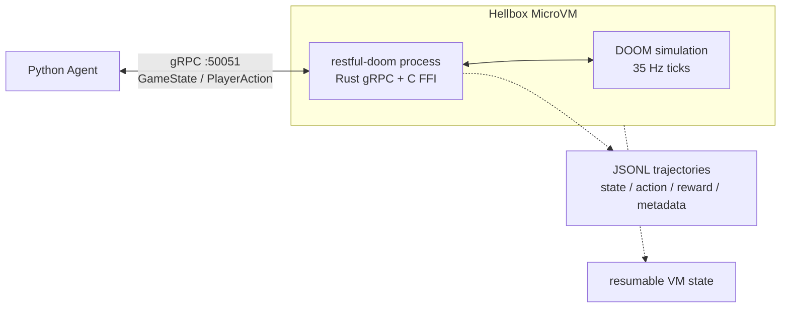

# RESTful-DOOM Agent Mode

This fork turns DOOM into a deterministic, inspectable, remotely hosted agent
environment. A protobuf + gRPC bridge runs inside the Doom process, publishes
structured state every simulated tic, and accepts actions over a bidirectional
observe-act stream.

The original HTTP + JSON REST API is still here. The new path is the agent
capsule: headless RESTful-DOOM inside a Hellbox/Shrink MicroVM, reachable over
short-lived authenticated gRPC, with JSONL trajectories for replay and evals.

## Why This Exists

Hellbox's human-facing demo is a playable cloud microVM arcade: stream DOOM to a
browser, freeze the VM mid-fight, thaw it, and keep playing. This repo is the
machine-facing companion demo:

| Demo | Interface | Audience | Hook |
| --- | --- | --- | --- |
| Playable DOOM capsule | Browser video/audio/input | Humans, launch demos | Freeze a live game mid-fight |
| Agent DOOM capsule | gRPC structured state/actions | Agents, evals, sandboxing | Freeze a policy rollout and resume the same simulation |

The punchline is:

> Freeze an AI agent's game environment mid-policy rollout, thaw it later, and
> continue from the same simulation state.

## Architecture



## Fork Delta

This repo is a derivative of the original RESTful-DOOM and Chocolate Doom
lineage. The fork keeps the original HTTP + JSON API and adds:

- protobuf schema for agent-focused game state and actions
- Rust `tonic` gRPC server linked into the Doom binary as a static library
- C/Rust FFI bridge that publishes state after each `G_Ticker()` and overlays queued actions into `ticcmd`
- Python async client, deterministic smoke agent, reward scoring, Bedrock policy hook, and JSONL trajectory logging
- config-driven rollout goals, authenticated gRPC metadata, reconnect handling, and trajectory diagnostics
- Hellbox-style headless capsule packaging for a MicroVM-ready agent environment

## Original REST API Lineage

The original RESTful-DOOM premise is still preserved: an HTTP + JSON API hosted
inside the 1993 DOOM engine.


The original API allows external clients to query and manipulate game objects
while the game runs. It was built on top of
[Chocolate Doom](https://github.com/chocolate-doom/chocolate-doom), which keeps
the engine close to the original experience while making it easier to build on
modern systems.

Original blog post:
http://1amstudios.com/2017/08/01/restful-doom/

Original RAML API spec:

[API spec in RAML 1.0 format](https://github.com/jeff-1amstudios/restful-doom/blob/master/RAML/doom.raml)

## Build

### Building dependencies (needs to be run only once)

Takes care of building and configuring dependencies like SDL. Uses [chocpkg](https://github.com/chocolate-doom/chocpkg).
```
./configure-and-build.sh
```

### Compiling

Run `make` from the src (or root) directory. `src/restful-doom` will be created if the compile succeeds.

## Run

The DOOM engine is open source, but assets (art, maps etc) are not. You'll need to download an appropriate [WAD file](https://en.wikipedia.org/wiki/Doom_WAD) separately.

To run restful-doom on port 6666:
```
src/restful-doom -iwad <path/to/doom1.wad> -apiport 6666 ...
```

## gRPC API Details

RESTful-DOOM also includes a high-performance protobuf + gRPC bridge for AI agents. The
bridge runs inside the Doom process, publishes structured state after every simulated tic, and
accepts player actions over a bidirectional stream.

The shared schema lives at:

```
proto/restfuldoom/v1/agent.proto
```

Run Doom with the agent bridge on the default gRPC port:

```
src/restful-doom -iwad <path/to/doom1.wad> -warp 1 1 -skill 3 -agent
```

Or choose a port explicitly:

```
src/restful-doom -iwad <path/to/doom1.wad> -warp 1 1 -skill 3 -agentport 50051
```

The stream service is:

```
restfuldoom.v1.DoomAgent/GameSession
```

It returns `GameState` messages containing player state, enemy state, useful map objects,
level progress, and optional per-client `StateDelta` payloads. Actions can be high-level
semantic commands such as `ACTION_FORWARD` and `ACTION_SHOOT`, or exact raw `ticcmd` overlays
for low-level policies.

### Python Agent

Generate Python protobuf stubs and run the deterministic smoke agent:

```
cd agent
python -m pip install -r requirements.txt
PYTHONPATH=. python -m restfuldoom_agent.generate_stubs
PYTHONPATH=. python -m restfuldoom_agent.smoke_agent --endpoint 127.0.0.1:50051
```

Add `--trajectory-jsonl trajectories/run.jsonl` to the smoke agent to persist
state/action/reward records for replay or training analysis.
Use `--goal-preset survival|navigation|combat|item_collection|exit_seeking` to
switch reward shaping, and leave reconnect enabled for Hellbox demos so stderr
reports the gRPC status, backoff delay, and last observed Doom tick.

For repeatable demos, pass a rollout JSON config. CLI flags override values in
the file:

```
PYTHONPATH=. python -m restfuldoom_agent.smoke_agent \
    --config examples/hellbox-rollout.json \
    --endpoint 127.0.0.1:50051
```

The Python package includes:

- async gRPC client helpers
- streaming rollout API with reconnect/backoff and last-seen-tick reporting
- a deterministic smoke policy
- a structured local brain with tactical memory, skill selection, and policy evolution
- named goal/reward presets
- optional nonblocking AWS Bedrock text-reasoning policy
- JSONL trajectory logging
- JSON rollout config for goal injection, auth metadata, and demo budgets

### Structured Local Brain

The practical agent path is not an LLM pressing controls every tic. The fast
player is a local process that consumes protobuf `GameState`, chooses a small
skill, and sends `PlayerAction` back over gRPC. Codex or another LLM can then
act as the training operator: inspect failures, adjust goals/rewards, and
promote better policies.

For the concrete boundary between the fast controller, learned decision layer,
memory file, skill action space, and PPO observation vector, see
`docs/agent-learning-architecture.md`.

Run the first trainable brain against a local Doom gRPC endpoint:

```
PYTHONPATH=agent python -m restfuldoom_agent.brain_agent \
    --endpoint 127.0.0.1:50051 \
    --goal-preset combat \
    --max-states 700 \
    --evolve-runs 3 \
    --memory-path agent_memory/e1m1.json \
    --trajectory-jsonl trajectories/brain.jsonl
```

The brain persists cross-run memory in `agent_memory/e1m1.json`: visited map
cells, enemy sightings, lessons from deaths/kills, and the best promoted
policy parameters. Each evolution run mutates the current best parameters,
scores the real rollout with the selected reward preset, and promotes the
candidate when its fitness beats the stored baseline.

The gRPC stream includes a compact `NavigationProbe` so the brain can avoid
video latency and REST map queries. Each state reports whether forward/back/side
movement is locally open, whether a usable line is ahead, and the distance to
the front blocking line. The local policy uses this to open doors, sidestep, or
turn away from blocked geometry while hunting enemies from protobuf state.

The default success target is intentionally concrete: complete a level and score
at least one kill in the same autonomous run. Until that happens, the training
job is still in progress even if fitness improves.

The Codex MCP server exposes the same path through `brain_drive` and
`brain_memory`, so Codex can run a goal, inspect memory, adjust rewards, and
iterate without relying on screenshots for control.

Train the learned decision layer from successful trajectory records:

```
PYTHONPATH=agent python -m restfuldoom_agent.brain_agent \
    --memory-path agent_memory/e1m1.json \
    --train-skill-model agent_models/skill-policy.json \
    --skill-model-trajectory trajectories/brain-train-68-current-success.jsonl
```

This writes a `restfuldoom.skill_policy.v1` JSON checkpoint. The current model
is a dependency-light softmax classifier over compact protobuf features; it
learns which high-level skill the structured brain selected, while the
deterministic controller still owns tic-level movement, aiming, firing, and
door use. Pass `--skill-model-path agent_models/skill-policy.json` during a
rollout to attach learned skill predictions to trajectory metadata.

Export the current training job before moving from Docker to cloud:

```
PYTHONPATH=agent python -m restfuldoom_agent.brain_agent \
    --memory-path agent_memory/e1m1.json \
    --export-job training-jobs/restfuldoom-agent-training.tar.gz
```

The bundle uses schema `restfuldoom.training_job.v1` and includes a manifest,
memory, promoted parameters, `agent-notes.md`, learned model checkpoints, and
referenced JSONL trajectories. When PPO checkpoints exist in memory, the same
bundle also includes `agent_models/ppo/*.pt`, optimizer state, observation
schema, action schema, reward config, and eval history. A cloud worker can
import it and continue training against a new gRPC endpoint:

```
PYTHONPATH=agent python -m restfuldoom_agent.brain_agent \
    --import-job training-jobs/restfuldoom-agent-training.tar.gz \
    --import-destination .
```

### PPO Skill Learning

Full RL uses the protobuf state stream directly. The agent first learns to
choose high-level skills while the deterministic controller still handles
tic-level movement, aiming, firing, and door use. This keeps the first PPO
target tractable and avoids screenshot latency.

The training API is:

- `ResetEpisode` queues a fast in-process reset on Doom's simulation thread.
- `DoomAgentEnv.reset()` calls that reset and returns a compact feature vector.
- `DoomAgentEnv.step(action)` sends one PPO-selected skill action and returns
  `(observation, reward, done, info)`.
- `--bc-trajectory` can warm-start the PPO actor from successful protobuf
  trajectory decisions before live reward updates.
- `--reset-warmup-*` can run bounded heuristic curriculum warmup before PPO
  collection starts, with warmup tics and stop reasons reported in rollout
  summaries.
- `--reset-start-*` can request a fresh-reset curriculum start: position,
  facing, health, armor, and ammo are applied inside Doom before the first
  training observation is published.
- `restfuldoom_agent.ppo` provides actor-critic PPO, GAE, clipped objective,
  entropy bonus, rollout JSONL buffers, checkpoint save/load, and a promotion
  gate.
- Combat rewards include enemy damage deltas from protobuf enemy health, so PPO
  can receive feedback before a full kill lands. They also include nearest-enemy
  distance progress from protobuf enemy distances, so early policies get
  navigation signal before line of sight.
- Checkpoints and rollout buffers carry `restfuldoom.observation.v1` and
  `restfuldoom.skill_action.v1`, including feature descriptors and
  machine-readable definitions for each PPO skill.

Run a small PPO batch against a live gRPC Doom endpoint:

```
PYTHONPATH=agent python -m restfuldoom_agent.ppo_agent \
    --endpoint 127.0.0.1:50051 \
    --goal-preset combat \
    --updates 1 \
    --rollout-steps 512 \
    --checkpoint-dir agent_models/ppo \
    --buffer-dir trajectories/ppo \
    --memory-path agent_memory/e1m1.json
```

Warm-start from a known successful trajectory:

```
PYTHONPATH=agent python -m restfuldoom_agent.ppo_agent \
    --endpoint 127.0.0.1:50051 \
    --goal-preset combat \
    --updates 5 \
    --rollout-steps 256 \
    --bc-trajectory trajectories/brain-train-68-current-success.jsonl \
    --bc-epochs 6 \
    --checkpoint-dir agent_models/ppo \
    --buffer-dir trajectories/ppo \
    --memory-path agent_memory/e1m1.json
```

Fresh combat-start curriculum is available for fast PPO experiments:

```
PYTHONPATH=agent python -m restfuldoom_agent.ppo_agent \
    --endpoint 127.0.0.1:50051 \
    --goal-preset combat \
    --updates 8 \
    --rollout-steps 128 \
    --checkpoint-dir agent_models/ppo \
    --buffer-dir trajectories/ppo \
    --memory-path agent_memory/e1m1.json \
    --reset-start-x-fp 212860928 \
    --reset-start-y-fp -214958080 \
    --reset-start-face-nearest-enemy \
    --reset-start-health 100 \
    --reset-start-ammo-bullets 50
```

Bounded curriculum warmup is still available for experiments, but current local
evidence shows that repeatedly warming from the default E1M1 spawn is too slow
for the PPO inner loop. Fresh-reset `EpisodeStart` is useful for combat
curriculum, while true save-state or Hellbox/Shrink snapshot restore is still
needed for progressed-map curriculum.

The checkpoint schema is `restfuldoom.ppo_checkpoint.v1`. Each checkpoint
stores model weights, optimizer state, PPO config, observation/action schemas,
reward config, and eval history. The promotion gate should compare PPO against
the deterministic baseline before replacing the current brain.

Current reset caveat: `ResetEpisode` accepts a seed and echoes it in the
response, but reports `seed_applied=false` until Doom RNG seeding is wired and
verified. Treat seeds as run labels for now, not deterministic replay proof.

### Local Docker + Codex MCP

For local Mac testing without Hellbox/Shrink, build the gRPC image and drive it
from Codex through the included MCP server:

```
docker build -f capsule/Dockerfile -t restful-doom-agent:local .
scripts/install-codex-mcp.sh
```

Restart Codex or open a new thread after installation. The `restful_doom` MCP
server exposes tools to build/start/stop the Dockerized Doom process, observe
one protobuf `GameState`, open real in-game footage at `http://127.0.0.1:6080`,
and run a deterministic rollout that writes JSONL trajectories. The optional
protobuf spectator remains available at `http://127.0.0.1:8765` for debugging.
See `docs/codex-mcp.md`.

### Resilient Rollout Demo

Run a long-lived rollout with a narratable goal and incremental trajectory log:

```
PYTHONPATH=agent python -m restfuldoom_agent.smoke_agent \
    --config agent/examples/hellbox-rollout.json \
    --endpoint 127.0.0.1:50051 \
    --trajectory-jsonl trajectories/combat.jsonl
```

If the gRPC stream drops during a Hellbox freeze/thaw or process restart, the
client prints reconnect notices to stderr:

```
{"attempt":1,"code":"UNAVAILABLE","delay_seconds":0.25,"details":"Stream removed (Socket closed)","event":"reconnect","last_seen_tick":1234}
{"attempt":2,"code":"UNAVAILABLE","delay_seconds":0.5,"details":"failed to connect to all addresses","event":"reconnect","last_seen_tick":1234}
```

Trajectory records are written one line at a time so rollouts do not retain the
full state history in memory:

```
{"index":0,"last_seen_tick":1234,"metadata":{"bedrock_fallback_count":0,"last_token_usage":{},"llm_latency_ms":null,"policy_errors":0,"reconnect_count":0,"rollout":{"agent_port":50051,"endpoint_host":"127.0.0.1:50051","goal_preset":"navigation","max_states":500,"token_present":false}},"next_action":{"action":7,"amount":10,"duration_tics":1},"reconnect_attempts":0,"reward":{"done":false,"health_delta":0,"item_delta":0,"kill_delta":0,"progress_delta":0.0,"reward":0.0,"secret_delta":0},"state":{"enemy_count":6,"health":100,"tick":1234}}
```

`last_seen_tick` makes reconnect behavior debuggable. For training/eval
lineage, a future server-side run id should distinguish a thawed VM from a new
Doom process that happens to listen on the same endpoint.

### Hellbox Capsule

Hellbox is the demo and brand. `shrink` is the MicroVM capsule runtime CLI.
`agent-doom` is the headless Doom capsule, and `restful-doom` is the Doom agent
environment implementation.

The `capsule/` directory contains a Hellbox-style headless capsule that builds this repo,
starts Doom in agent mode, exposes gRPC on `50051`, and uses the MicroVM ready hook on `9000`.
The capsule contract is declared in `capsule/agent-doom.hellbox.json`. See
`docs/hellbox/agent-capsule.md`.

External capsule demo path:

```
RESTFUL_DOOM_CAPSULE_DIR="$PWD/capsule" shrink build --name agent-doom
shrink up agent-doom
shrink token agent-doom --port 50051 --minutes 60 --raw > trajectories/agent-doom-token.json
scripts/hellbox-agent-demo.sh run
shrink suspend --name agent-doom
shrink resume --name agent-doom
```

For docs or screenshots, omit `--raw`; `shrink token` redacts
`headers.x-aws-proxy-auth` by default while preserving the stable
`schema: "shrink.auth.v1"` shape.

The strongest demo loop is:

1. Launch the headless RESTful-DOOM agent capsule in a Hellbox MicroVM.
2. Mint short-lived access for gRPC port `50051`.
3. Run the Python smoke agent and persist JSONL trajectories.
4. Freeze the MicroVM mid-rollout.
5. Thaw it and continue from the same simulation state.

## Thanks!
[chocolate-doom](https://github.com/chocolate-doom/chocolate-doom) team  
[cJSON](https://github.com/DaveGamble/cJSON) - JSON parsing / generation  
[yuarel](https://github.com/jacketizer/libyuarel/) - URL parsing  
