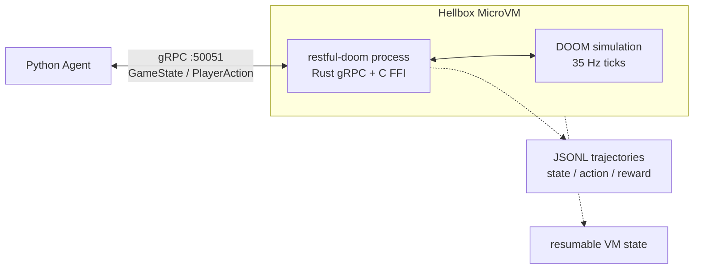

# RESTful-DOOM

This fork adds a protobuf + gRPC Agent Mode and Hellbox capsule surface for
running DOOM as a headless, structured agent environment inside a cloud
MicroVM. The original REST API is still available, but the main new path is a
bidirectional 35 Hz observe-act stream for AI policies.

An HTTP + JSON API hosted inside the 1993 DOOM engine!


RESTful-DOOM is a version of Doom which hosts a RESTful API! The API allows you to query and manipulate various game objects with standard HTTP requests as the game runs.

There were a few challenges:

- Build an HTTP+JSON RESTful API server in C.
- Run the server code inside the Doom engine, without breaking the game loop.
- Figure out what kinds of things we can manipulate in the game world, and how to interact with them in memory to achieve the desired effect!

RESTFul-DOOM is built on top of the awesome [Chocolate Doom](https://github.com/chocolate-doom/chocolate-doom) project. I like this project because it aims to stick as close to the original experience as possible, while making it easy to compile and run on modern systems. This was only possible by building on top of their hard work!

### More details in blog post:
http://1amstudios.com/2017/08/01/restful-doom/

## Fork Delta

This fork keeps the original HTTP + JSON API and adds:

- protobuf schema for agent-focused game state and actions
- Rust `tonic` gRPC server linked into the Doom binary as a static library
- C/Rust FFI bridge that publishes state after each `G_Ticker()` and overlays queued actions into `ticcmd`
- Python async client, deterministic smoke agent, reward scoring, Bedrock policy hook, and JSONL trajectory logging
- Hellbox-style headless capsule packaging for a MicroVM-ready agent environment

## API Spec

[API spec in RAML 1.0 format](https://github.com/jeff-1amstudios/restful-doom/blob/master/RAML/doom.raml)

## Build

### Building dependencies (needs to be run only once)

Takes care of building and configuring dependencies like SDL. Uses [chocpkg](https://github.com/chocolate-doom/chocpkg).
```
./configure-and-build.sh
```

### Compiling

Run `make` from the src (or root) directory. `src/restful-doom` will be created if the compile succeeds.

## Run

The DOOM engine is open source, but assets (art, maps etc) are not. You'll need to download an appropriate [WAD file](https://en.wikipedia.org/wiki/Doom_WAD) separately.

To run restful-doom on port 6666:
```
src/restful-doom -iwad <path/to/doom1.wad> -apiport 6666 ...
```

## gRPC Agent Mode

RESTful-DOOM also includes a high-performance protobuf + gRPC bridge for AI agents. The
bridge runs inside the Doom process, publishes structured state after every simulated tic, and
accepts player actions over a bidirectional stream.



The shared schema lives at:

```
proto/restfuldoom/v1/agent.proto
```

Run Doom with the agent bridge on the default gRPC port:

```
src/restful-doom -iwad <path/to/doom1.wad> -warp 1 1 -skill 3 -agent
```

Or choose a port explicitly:

```
src/restful-doom -iwad <path/to/doom1.wad> -warp 1 1 -skill 3 -agentport 50051
```

The stream service is:

```
restfuldoom.v1.DoomAgent/GameSession
```

It returns `GameState` messages containing player state, enemy state, useful map objects,
level progress, and optional per-client `StateDelta` payloads. Actions can be high-level
semantic commands such as `ACTION_FORWARD` and `ACTION_SHOOT`, or exact raw `ticcmd` overlays
for low-level policies.

### Python Agent

Generate Python protobuf stubs and run the deterministic smoke agent:

```
cd agent
python -m pip install -r requirements.txt
PYTHONPATH=. python -m restfuldoom_agent.generate_stubs
PYTHONPATH=. python -m restfuldoom_agent.smoke_agent --endpoint 127.0.0.1:50051
```

Add `--trajectory-jsonl trajectories/run.jsonl` to the smoke agent to persist
state/action/reward records for replay or training analysis.

The Python package includes:

- async gRPC client helpers
- a deterministic smoke policy
- goal/reward scoring
- optional AWS Bedrock text-reasoning policy
- JSONL trajectory logging

### Hellbox Capsule

The `capsule/` directory contains a Hellbox-style headless capsule that builds this repo,
starts Doom in agent mode, exposes gRPC on `50051`, and uses the MicroVM ready hook on `9000`.
See `docs/hellbox/agent-capsule.md`.

The strongest demo loop is:

1. Launch the headless RESTful-DOOM agent capsule in a Hellbox MicroVM.
2. Mint short-lived access for gRPC port `50051`.
3. Run the Python smoke agent and persist JSONL trajectories.
4. Freeze the MicroVM mid-rollout.
5. Thaw it and continue from the same simulation state.

## Thanks!
[chocolate-doom](https://github.com/chocolate-doom/chocolate-doom) team  
[cJSON](https://github.com/DaveGamble/cJSON) - JSON parsing / generation  
[yuarel](https://github.com/jacketizer/libyuarel/) - URL parsing  
