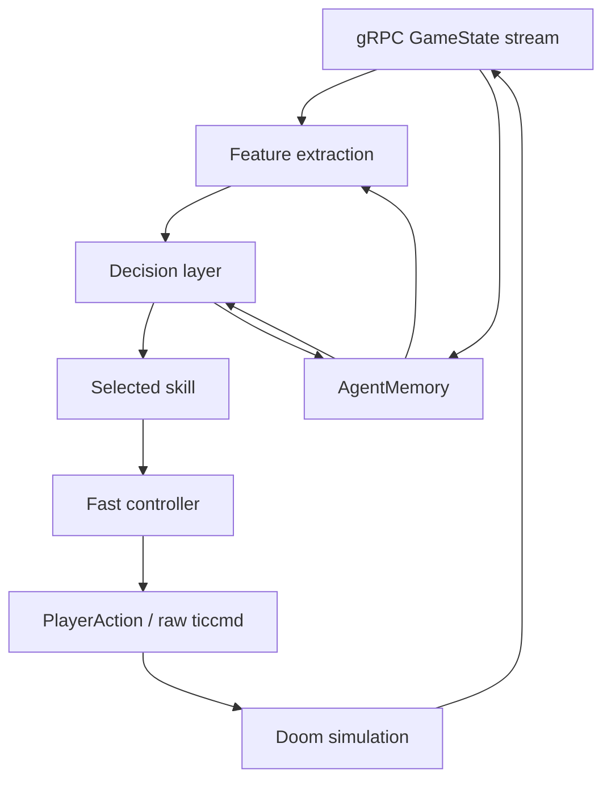

# Agent Learning Architecture

This repo has two agent layers that should stay separate:

1. The fast controller turns one selected skill into safe tic-level Doom input.
2. The decision layer chooses which skill should run next.

The current training path intentionally learns the second layer first. Directly
learning raw `ticcmd` at 35 Hz is possible later, but it makes early PPO spend
most of its time rediscovering aiming, door use, and stuck recovery. Skill-level
learning gives the model a smaller action space while still using the real
protobuf stream and real Doom rewards.

## Runtime Stack

The loop has these concrete implementations:

- `DoomAgentClient` owns the bidirectional gRPC stream.
- `BrainPolicy` is the hand-built fast policy plus controller.
- `SkillController` wraps `BrainPolicy` for PPO by exposing eight stable skill
  actions.
- `DoomAgentEnv` is the Gym-style environment used by PPO.
- `SkillPolicyModel` is the behavior-cloned softmax selector trained from good
  trajectory decisions.
- `PPOTrainer` is the independent RL learner for skill selection.

## Fast Controller vs Decision Layer

The fast controller is the code that knows how to execute local movement and
combat safely. It handles:

- aiming toward a visible or remembered enemy
- firing only when the combat probe says the shot is valid
- retreating and strafing around close enemies
- using doors and switches
- avoiding blocked geometry
- escaping stuck cells and damaging floor cells

The decision layer is the code that chooses the next intent. Today there are
three decision sources:

- `BrainPolicy`: deterministic heuristic decision source used for successful
  baseline runs.
- `SkillPolicyModel`: behavior-cloned classifier that predicts the skill the
  heuristic would have selected from a successful trajectory.
- `PPOTrainer`: actor-critic model that independently chooses one of the PPO
  skill actions from reward feedback.

`SkillController.action_for(action_index, state)` is the bridge. PPO selects a
skill index. The controller maps that skill into the existing fast controller
logic and returns a concrete protobuf `PlayerAction`. `DoomAgentEnv.step()`
then waits through the action duration and reports one aggregated macro-step
back to PPO.

## Skill Representation

The PPO skill action space is in `restfuldoom_agent.schemas.PPO_SKILL_ACTIONS`:

- `engage`
- `fire`
- `seek_enemy`
- `open_use_line`
- `route_progression`
- `retreat`
- `recover_stuck`
- `press_exit`

These are currently code-defined skills, not external config. That is
intentional while the low-level behavior is still being hardened. Each skill is
implemented as a branch in `SkillController._execute_skill()` and delegates to
small controller methods in `BrainPolicy`.

The learned policies do not learn the movement primitive itself yet. They learn
when to call the primitive. That keeps the first independent RL objective
tractable and lets existing protobuf affordances carry most low-level Doom
knowledge.

## Memory Contract

`AgentMemory` persists to `agent_memory/e1m1.json` using schema
`restfuldoom.agent_memory.v1`. It is a JSON document that can be exported with a
training job and resumed in Docker, Hellbox, or a cloud worker.

The important sections are:

- `cells`: visit counts, enemy sightings, damage events, and last-seen ticks for
  coarse map cells.
- `enemies`: last seen position, health, distance, line of sight, and threat per
  enemy id.
- `episodes`: compact summaries from recent real rollouts.
- `policy`: best deterministic parameters, best score, success flags, and the
  promoted run id.
- `learned_policy`: behavior-cloned skill selector metadata.
- `ppo_policy`: latest PPO checkpoint metadata, reward config, rollout summary,
  and eval history.
- `ppo_checkpoints`: exported PPO checkpoint lineage.

Memory is updated during real rollouts by `AgentMemory.record_step()` and
`AgentMemory.finish_episode()`. PPO writes checkpoint metadata through
`ppo_agent._record_ppo_checkpoint()` and writes eval outcomes through
`ppo_agent._record_eval_history()`.

Memory is not a neural hidden state. It is an explicit, inspectable world and
training ledger. The learned model gets compact features derived from current
protobuf state plus selected memory-derived features such as remembered enemies,
stuck state, and blocked targets.

## Observation Contract

PPO receives the feature vector declared in
`restfuldoom_agent.skill_policy.FEATURE_NAMES`. It is derived from protobuf
state, not screenshots. Current feature groups are:

- player health, ammo, kills, and items
- normalized map position and facing
- visible, known, and remembered enemy counts
- nearest enemy distance, angle, threat, and health
- combat probe target validity and distance
- local navigation probes for front/back/side openness
- usable-line and exit-line affordances
- stuck and blocked-target indicators

This is good enough for early skill learning, but it is not yet a complete
learning observation. Known gaps:

- No compact topological map graph, only local probes plus coarse cell memory.
- No explicit sector type, floor damage, or hazard affordance in the PPO vector.
- No recent action history beyond what the recurrent-free policy can infer from
  state changes.
- No normalized objective/route waypoint beyond optional target coordinates in
  reward config.
- No enemy projectile or incoming-damage prediction.
- No deterministic RNG seed application yet; reset seed is currently a label,
  not replay proof.

These gaps explain why the first PPO runs show distance-progress reward before
damage or kills. The model can learn "approach enemy" from the current vector,
but it needs stronger combat-opportunity features and action-aware rewards to
learn "fire now" reliably.

## Promotion Rule

Reward shaping is not enough for promotion. A PPO checkpoint is only promotable
when it beats the baseline gate and satisfies the project success floor:

- completion rate at or above the configured minimum, default `1.0`
- mean kills at or above the configured minimum, default `1.0`
- no regression on survival, time-to-exit, or stuck events
- reward is compared, but reward alone cannot promote a checkpoint

This keeps dense shaping useful for training without confusing movement reward
with actual game competence.

## Behavior Cloning Bootstrap

PPO can be warm-started from successful protobuf trajectories before live RL
updates. The bootstrap path:

1. Reads trajectory JSONL records with `metadata.policy_decision.skill`.
2. Maps rich expert skills into the eight stable PPO skills using
   `EXPERT_TO_PPO_SKILL_ACTION`.
3. Trains the actor with supervised cross-entropy.
4. Continues normal PPO collection and updates against live Doom reward.

This is not the final intelligence layer. It is a curriculum tool that gets the
policy closer to useful behavior than a uniformly random skill selector. Live
reward and the promotion gate still decide whether the checkpoint is useful.

## Reset Curriculum

`DoomAgentEnv` can optionally run heuristic-only warmup after reset and before
PPO starts collecting transitions. Warmup can stop on:

- first visible enemy
- first shootable combat target
- step limit
- hard tic limit
- death or level change

The rollout summary reports warmup steps, tics, and stop reasons. Current local
evidence shows naive warmup from the default E1M1 spawn is too expensive for the
inner PPO loop and often hits the tic limit before reaching combat. The next
real unlock is cached start states or server-side snapshot restore so PPO can
train from combat-relevant initial states without replaying the whole route
from spawn every reset.

## Next Architecture Work

The next useful changes are:

- Add hazard/sector features to the PPO observation vector.
- Add short action-history features, such as previous skill and previous
  shootable-target state.
- Add server-side curriculum starts, either through save-state restore or
  Hellbox/Shrink snapshot restore, so PPO can train from cached combat states.
- Promote combat affordances from binary target presence to richer target
  quality, including aim error, weapon range, and cooldown.
- Make skill definitions data-described after the set stabilizes, so training
  jobs can declare the action space without reading code.
- Wire true deterministic seed application in the Doom reset path.
