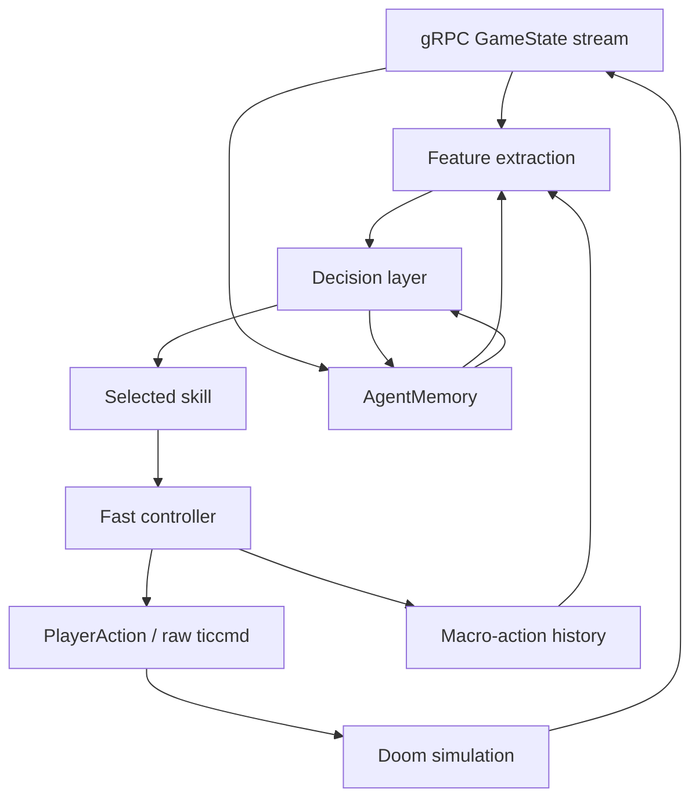

# Agent Learning Architecture

This repo has two agent layers that should stay separate:

1. The fast controller turns one selected skill into safe tic-level Doom input.
2. The decision layer chooses which skill should run next.

The current training path intentionally learns the second layer first. Directly
learning raw `ticcmd` at 35 Hz is possible later, but it makes early PPO spend
most of its time rediscovering aiming, door use, and stuck recovery. Skill-level
learning gives the model a smaller action space while still using the real
protobuf stream and real Doom rewards.

## Runtime Stack

The loop has these concrete implementations:

- `DoomAgentClient` owns the bidirectional gRPC stream.
- `BrainPolicy` is the hand-built fast policy plus controller.
- `SkillController` wraps `BrainPolicy` for PPO by exposing eight stable skill
  actions.
- `DoomAgentEnv` is the Gym-style environment used by PPO.
- `SkillPolicyModel` is the behavior-cloned softmax selector trained from good
  trajectory decisions.
- `PPOTrainer` is the independent RL learner for skill selection.

## Fast Controller vs Decision Layer

The fast controller is the code that knows how to execute local movement and
combat safely. It handles:

- aiming toward a visible or remembered enemy
- firing only when the combat probe says the shot is valid
- retreating and strafing around close enemies
- using doors and switches
- avoiding blocked geometry
- escaping stuck cells and damaging floor cells

The decision layer is the code that chooses the next intent. Today there are
three decision sources:

- `BrainPolicy`: deterministic heuristic decision source used for successful
  baseline runs.
- `SkillPolicyModel`: behavior-cloned classifier that predicts the skill the
  heuristic would have selected from a successful trajectory.
- `PPOTrainer`: actor-critic model that independently chooses one of the PPO
  skill actions from reward feedback.

The bridge is an explicit macro-step handshake:

1. `DoomAgentEnv.step(action_index)` receives one PPO skill action.
2. `SkillController.action_for(action_index, state)` extracts tactical features
   from the latest protobuf `GameState` and returns one concrete protobuf
   `PlayerAction`.
3. `DoomAgentEnv` sends that action over the bidirectional gRPC stream and
   waits through its bounded `duration_tics`.
4. The environment aggregates reward, transition metadata, and terminal state
   across those tics.
5. `SkillController.record_action_history()` stores the previous skill,
   shootable-target opportunity, and same-skill streak for the next
   observation.
6. The next PPO observation is current protobuf state plus memory-derived
   features plus that macro-action history.

`SkillController.reset_episode_context()` clears the action-history features at
episode boundaries and after heuristic reset warmup, so PPO does not inherit
stale controller state from a previous episode.

## Skill Representation

The PPO skill action space is in `restfuldoom_agent.schemas.PPO_SKILL_ACTIONS`:

- `engage`
- `fire`
- `seek_enemy`
- `open_use_line`
- `route_progression`
- `retreat`
- `recover_stuck`
- `press_exit`

These are currently code-defined skills, not learned movement primitives. Each
skill is implemented as a branch in `SkillController._execute_skill()` and
delegates to small controller methods in `BrainPolicy`.

The action space is now also exported as data through
`restfuldoom_agent.schemas.ACTION_SCHEMA` using schema
`restfuldoom.skill_action.v1`. Checkpoints, rollout buffers, and training-job
bundles carry a definition for every skill: index, name, controller entrypoint,
role, primary signal, and fallback. This is enough for a future cloud worker or
MCP surface to inspect "what action 3 means" without importing private
controller internals.

The learned policies do not learn the movement primitive itself yet. They learn
when to call the primitive. That keeps the first independent RL objective
tractable and lets existing protobuf affordances carry most low-level Doom
knowledge.

## Memory Contract

`AgentMemory` persists to `agent_memory/e1m1.json` using schema
`restfuldoom.agent_memory.v1`. It is a JSON document that can be exported with a
training job and resumed in Docker, Hellbox, or a cloud worker.

The important sections are:

- `cells`: visit counts, enemy sightings, damage events, and last-seen ticks for
  coarse map cells.
- `enemies`: last seen position, health, distance, line of sight, and threat per
  enemy id.
- `episodes`: compact summaries from recent real rollouts.
- `policy`: best deterministic parameters, best score, success flags, and the
  promoted run id.
- `learned_policy`: behavior-cloned skill selector metadata.
- `ppo_policy`: latest PPO checkpoint metadata, reward config, rollout summary,
  and eval history.
- `ppo_checkpoints`: exported PPO checkpoint lineage.

Memory has named update and query paths:

- `AgentMemory.record_step()` updates cells, enemy sightings, damage events,
  and per-episode stats after each real rollout transition.
- `AgentMemory.finish_episode()` appends compact rollout summaries and promotes
  deterministic policy parameters when the candidate beats stored policy memory.
- `AgentMemory.remembered_enemies()` is the explicit query path for feature
  extraction. It returns recent enemy sightings by id, last position, last tick,
  and current distance while rejecting stale or future-tick records.
- PPO writes checkpoint metadata through `ppo_agent._record_ppo_checkpoint()`
  and eval outcomes through `ppo_agent._record_eval_history()`.

Memory is not a neural hidden state. It is an explicit, inspectable world and
training ledger. The learned model gets compact features derived from current
protobuf state plus selected memory-derived features such as remembered enemies,
stuck state, and blocked targets.

## Observation Contract

PPO receives the feature vector declared in
`restfuldoom_agent.schemas.OBSERVATION_SCHEMA`. It is derived from protobuf
state, memory, and macro-action history, not screenshots. The current schema has
52 features: 42 base tactical features plus 10 action-history features.

The base feature groups are:

- player health, ammo, kills, and items
- normalized map position and facing
- visible, known, and remembered enemy counts
- nearest enemy distance, angle, threat, and health
- combat probe target validity and distance
- local navigation probes for front/back/side openness
- usable-line and exit-line affordances
- stuck and blocked-target indicators

The action-history group is:

- one-hot previous PPO skill
- whether the previous macro-step had a shootable target
- same-skill streak normalized by 8

This is good enough for early skill learning, but it is not yet a complete
learning observation. Known gaps:

- No compact topological map graph, only local probes plus coarse cell memory.
- No explicit sector type, floor damage, or hazard affordance in the PPO vector.
- Only one macro-step of action history; there is no recurrent state or longer
  temporal context yet.
- No normalized objective/route waypoint beyond optional target coordinates in
  reward config.
- No enemy projectile or incoming-damage prediction.
- No deterministic RNG seed application yet; reset seed is currently a label,
  not replay proof.

These gaps explain why the first PPO runs show distance-progress reward before
damage or kills. The model can learn "approach enemy" from the current vector,
but it needs stronger combat-opportunity features and action-aware rewards to
learn "fire now" reliably.

## Promotion Rule

Reward shaping is not enough for promotion. A PPO checkpoint is only promotable
when it beats the baseline gate and satisfies the project success floor:

- completion rate at or above the configured minimum, default `1.0`
- mean kills at or above the configured minimum, default `1.0`
- no regression on survival, time-to-exit, or stuck events
- reward is compared, but reward alone cannot promote a checkpoint

This keeps dense shaping useful for training without confusing movement reward
with actual game competence.

## Behavior Cloning Bootstrap

PPO can be warm-started from successful protobuf trajectories before live RL
updates. The bootstrap path:

1. Reads trajectory JSONL records with `metadata.policy_decision.skill`.
2. Maps rich expert skills into the eight stable PPO skills using
   `EXPERT_TO_PPO_SKILL_ACTION`.
3. Trains the actor with supervised cross-entropy.
4. Continues normal PPO collection and updates against live Doom reward.

This is not the final intelligence layer. It is a curriculum tool that gets the
policy closer to useful behavior than a uniformly random skill selector. Live
reward and the promotion gate still decide whether the checkpoint is useful.

## Reset Curriculum

`DoomAgentEnv` has two curriculum mechanisms.

First, it can ask the server to apply a fresh-reset `EpisodeStart` through
`ResetEpisode`. The start can include:

- player position
- explicit angle or `face_nearest_enemy`
- health and armor
- starting ammo

The C game loop applies this on the simulation thread after `G_DeferedInitNew`
and before publishing the next protobuf state. This is not a save-state restore:
the level is still freshly reset, so opened doors, enemy movement, and map
mutations from a later trajectory are not replayed. It is useful for cheap
combat starts and should eventually be replaced or complemented by true
snapshot restore for long-route curriculum.

Second, the environment can optionally run heuristic-only warmup after reset and
before PPO starts collecting transitions. Warmup can stop on:

- first visible enemy
- first shootable combat target
- step limit
- hard tic limit
- death or level change

The rollout summary reports warmup steps, tics, and stop reasons. Current local
evidence shows naive warmup from the default E1M1 spawn is too expensive for the
inner PPO loop and often hits the tic limit before reaching combat.

The useful fresh-reset combat start found so far is:

- Doom units: `x=3248`, `y=-3280`
- fixed-point: `x_fp=212860928`, `y_fp=-214958080`
- flags: `face_nearest_enemy=true`, `health=100`, `ammo_bullets=50`

From that start, protobuf reports line of sight to three enemies and an
immediate shootable target after reset.

## Current Learning Evidence

The deterministic structured brain has already met the project's first good
state: complete E1M1 and kill enemies along the way. PPO is still in transition.

Recent PPO evidence:

- `ppo-episode-start-combat-smoke`: BC-warm PPO from the fresh combat start got
  `max_kills=1` in all three 128-transition updates, with `damage_delta` 60,
  65, and 70. This proves the PPO environment/reward/controller loop can score
  combat, but it is not pure independent learning because BC initialized the
  actor.
- `ppo-independent-combat-start-smoke`: PPO from scratch improved fire
  selections from 15/128 to 43/128, action reward from `1.91` to `11.73`, total
  reward from `12.4953` to `23.2953`, and late-update damage back to 40. It did
  not score a kill in eight short updates. This is the first independent
  reward-driven learning signal, not a promotable policy.

## Next Architecture Work

The next useful changes are:

- Add hazard/sector features to the PPO observation vector.
- Extend action history beyond one macro-step or add a recurrent policy.
- Add true save-state or Hellbox/Shrink snapshot restore so PPO can train from
  progressed map states, not only fresh-reset teleport starts.
- Promote combat affordances from binary target presence to richer target
  quality, including aim error, weapon range, and cooldown.
- Move skill definitions from exported descriptors to optional external config
  after the action set stabilizes.
- Wire true deterministic seed application in the Doom reset path.
