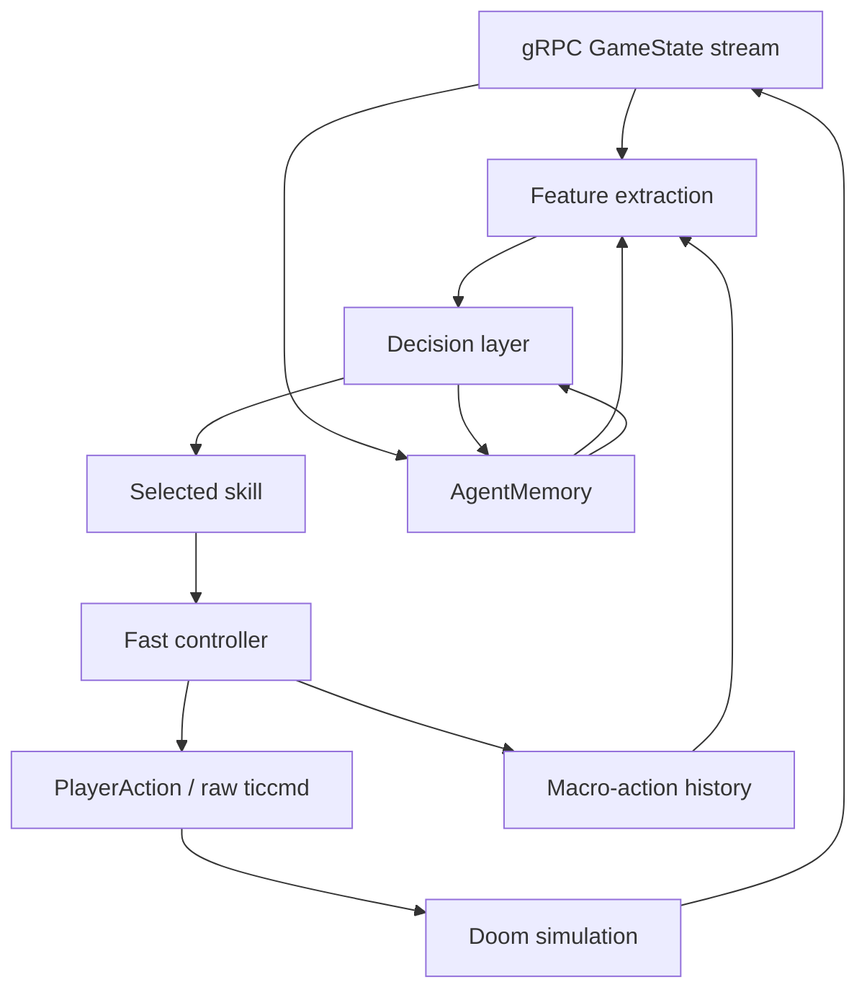

# Agent Learning Architecture

This repo has two agent layers that should stay separate:

1. The fast controller turns one selected skill into safe tic-level Doom input.
2. The decision layer chooses which skill should run next.

The current training path intentionally learns the second layer first. Directly
learning raw `ticcmd` at 35 Hz is possible later, but it makes early PPO spend
most of its time rediscovering aiming, door use, and stuck recovery. Skill-level
learning gives the model a smaller action space while still using the real
protobuf stream and real Doom rewards.

## Runtime Stack

The loop has these concrete implementations:

- `DoomAgentClient` owns the bidirectional gRPC stream.
- `BrainPolicy` is the hand-built fast policy plus controller.
- `SkillController` wraps `BrainPolicy` for PPO by exposing nine stable skill
  actions.
- `DoomAgentEnv` is the Gym-style environment used by PPO.
- `SkillPolicyModel` is the behavior-cloned softmax selector trained from good
  trajectory decisions.
- `PPOTrainer` is the independent RL learner for skill selection.

For the concrete implementation contract that maps this stack to schema
objects, JSONL fields, memory query/update paths, skill representation, and the
current observation gap register, see `docs/agent-training-interface.md`. The
shorter audit-oriented version is `docs/agent-runtime-contracts.md`.

## Fast Controller vs Decision Layer

The fast controller is the code that knows how to execute local movement and
combat safely. It handles:

- aiming toward a visible or remembered enemy
- firing only when the combat probe says the shot is valid
- retreating and strafing around close enemies
- using doors and switches
- avoiding blocked geometry
- escaping stuck cells and damaging floor cells

The decision layer is the code that chooses the next intent. Today there are
three decision sources:

- `BrainPolicy`: deterministic heuristic decision source used for successful
  baseline runs.
- `SkillPolicyModel`: behavior-cloned classifier that predicts the skill the
  heuristic would have selected from a successful trajectory.
- `PPOTrainer`: actor-critic model that independently chooses one of the PPO
  skill actions from reward feedback.

The bridge is an explicit macro-step handshake:

1. `DoomAgentEnv.step(action_index)` receives one PPO skill action.
2. `DoomAgentEnv.action_mask()` derives the feasible option set from the
   current protobuf state, memory, and transient controller state.
   Some masks intentionally protect short-lived option follow-through, such as
   firing during a shootable window or continuing a recent contact use-line
   long enough to activate it.
3. The PPO actor receives the observation plus mask and returns an action
   index. PPO also stores that same mask in the rollout buffer, then reuses it
   during the update when recomputing logprobs.
4. `SkillController.action_for(action_index, state)` extracts tactical features
   from the latest protobuf `GameState` and returns one concrete protobuf
   `PlayerAction`.
5. `DoomAgentEnv` sends that action over the bidirectional gRPC stream and
   waits through its bounded `duration_tics`.
6. The environment aggregates reward, transition metadata, and terminal state
   across those tics.
7. `SkillController.record_action_history()` stores the previous skill,
   shootable-target opportunity, and same-skill streak for the next
   observation.
8. The next PPO observation is current protobuf state plus memory-derived
   features plus that macro-action history.

That contract is exported as `restfuldoom.decision_cycle.v1` through
`restfuldoom_agent.schemas.DECISION_CYCLE_SCHEMA`. Rollout buffers and
checkpoints now carry the full contract. Each live `EnvStep.info` also includes
a compact `decision_cycle` object with the schema id, observation schema,
action schema, memory contract id, input tick, output tick, and macro tic
count. A single JSONL trajectory row therefore tells us exactly how the
decision layer, controller, memory, and Doom stream interacted.

For training audits, PPO rollout rows additionally carry
`info.learning_trace` (`restfuldoom.learning_trace.v1`). It names the relevant
pre-action observation groups, action-mask availability, selected PPO skill,
executed controller primitive, and reward/route/contact outcomes. The raw
vector remains in `rollout_record.obs`; the trace makes failures explainable
without changing model inputs.

The concrete runtime payload is:

| Step | Producer | Consumer | Payload |
| --- | --- | --- | --- |
| observe | `DoomAgentEnv` | PPO actor | `restfuldoom.observation.v1` feature vector and `restfuldoom.skill_action_mask.v1` boolean mask |
| decide | PPO actor | `DoomAgentEnv` | integer action index into `restfuldoom.skill_action.v1` |
| execute | `SkillController` | `DoomAgentClient` | one protobuf `PlayerAction` plus `rollout_record.info.decision` metadata |
| score | `DoomAgentEnv` | PPO buffer and memory | reward, transition deltas, route outcome, shootable-target flags, and schema markers |
| remember | `SkillController` / PPO trainer | next observation and `AgentMemory` | episode-local macro history plus persistent checkpoint/eval summaries |

The fast controller and decision layer therefore communicate only through
stable skill indexes, masks, protobuf state, and JSONL metadata. The controller
does not receive gradients or policy logits, and PPO does not send raw ticcmds.

The division of responsibility is intentionally strict:

| Boundary | Owns | Does not own |
| --- | --- | --- |
| PPO actor | choosing a skill index under the mask | raw turning, door timing, firing cadence |
| `SkillController` | converting a skill index into a safe local `PlayerAction` | long-term promotion or checkpointing |
| `BrainPolicy` | tactical primitives and heuristics used by the controller | gradient updates |
| `DoomAgentEnv` | reset, macro-step execution, reward aggregation, trajectory metadata | deciding which skill is good |
| `AgentMemory` | persistent world/training ledger and explicit query/update APIs | neural hidden state |

`SkillController.reset_episode_context()` clears the action-history features at
episode boundaries and after heuristic reset warmup, so PPO does not inherit
stale controller state from a previous episode.

`SkillController.action_mask(state)` is the feasibility contract for PPO
sampling. It derives a boolean mask from protobuf combat/navigation affordances
and memory:

- `fire` is available only when the combat probe reports a shootable enemy and
  the controller cooldown allows a shot.
- When a shootable enemy is available and the controller can fire, the mask
  follows through by suppressing normal `engage`, use-line, and route actions.
  This prevents PPO from creating a brief firing window and then immediately
  moving out of it before damage can land.
- `close_visible_contact` is available when an enemy is visible but not yet
  shootable, so PPO can choose contact closure directly instead of hiding that
  decision inside generic `engage`.
- `seek_enemy` remains available during visible-but-not-shootable contact when
  enemy memory/protobuf has a usable target.
- During visible-but-not-shootable contact, `close_visible_contact` and
  `seek_enemy` use contact-specific controller primitives: graded direction
  probes can use short-clearance rays, execution is limited to 1 tic, and the
  controller continues the remembered contact corridor if line of sight drops.
- `open_use_line` remembers a manual line selected during ready visible contact
  and can keep approaching it after line of sight drops, so PPO does not lose a
  close door/switch target at exactly the contact boundary.
- When a recent contact corridor or remembered contact use-line is active, the
  mask keeps contact actions available and suppresses generic route progression
  until that contact context expires. Contact use-line follow-through is
  bounded by same-skill streak when the line is still distant; close remembered
  lines can still be pressed with a small forward nudge.
- `route_progression` is not advertised merely because a contact route waypoint
  exists. Live probes showed that made PPO over-sample route movement during
  contact without reaching first-shootable combat. It remains callable for
  explicit experiments, but it is not part of the visible-contact mask.
- `retreat` is available only for low health or close threats.
- `seek_enemy` is available when no enemy is visible but memory/protobuf has a
  target to hunt.
- `close_visible_contact` is available when an enemy is visible but not yet a
  shootable target, or when a recent contact corridor can still be followed.
- `open_use_line`, `route_progression`, `recover_stuck`, and `press_exit` are
  enabled only when their corresponding affordances are present.

The PPO actor samples under this mask and the PPO update recomputes logprobs
under the same mask from the rollout buffer. This keeps exploration independent
while avoiding impossible or irrelevant skills.

## Skill Representation

The PPO skill action space is in `restfuldoom_agent.schemas.PPO_SKILL_ACTIONS`:

- `engage`
- `fire`
- `seek_enemy`
- `open_use_line`
- `route_progression`
- `retreat`
- `recover_stuck`
- `press_exit`
- `close_visible_contact`

These are currently code-defined options, not learned movement primitives. Each
skill is implemented as a branch in `SkillController._execute_skill()` and
delegates to small controller methods in `BrainPolicy`.

The action space is now also exported as data through
`restfuldoom_agent.schemas.ACTION_SCHEMA` using schema
`restfuldoom.skill_action.v1`. Checkpoints, rollout buffers, and training-job
bundles carry a definition for every skill: index, name, controller entrypoint,
role, primary signal, fallback, representation, execution owner, and mask
semantics. This is enough for a future cloud worker or MCP surface to inspect
"what action 3 means" without importing private controller internals.

The current representation is deliberately conservative:

- Skills are code-defined options in `SkillController._execute_skill()`.
- `ACTION_SCHEMA` is the exported definition contract for checkpoints,
  rollout buffers, and training bundles.
- PPO learns selection only: probability of choosing a skill and the value of
  that choice under reward.
- The controller owns the primitive mechanics: local aim, movement, use-line
  timing, fire cadence, and fallback behavior.

This means `fire` is not a learned function yet. It is a stable option whose
availability is masked by combat affordances, while PPO learns when selecting
that option is valuable. Later, a skill can become config-backed or dispatch to
a learned subpolicy, but only if it preserves the same index/name contract for
old checkpoints.

The learned policies do not learn the movement primitive itself yet. They learn
when to call the primitive. That keeps the first independent RL objective
tractable and lets existing protobuf affordances carry most low-level Doom
knowledge.

The current representation is:

| Skill | Representation | Learned part | Code-owned part |
| --- | --- | --- | --- |
| `engage` | code-defined option | when to approach/strafe a visible enemy | aiming and movement primitive |
| `fire` | code-defined option | when a shot opportunity is worth taking | shoot cooldown, target validation, raw button press |
| `seek_enemy` | code-defined option | when remembered enemy pursuit is useful | enemy-memory selection and route primitive |
| `open_use_line` | code-defined option | when a use affordance should be acted on | line targeting, turn/use timing |
| `route_progression` | code-defined option | when exploration/progression beats combat | line/frontier/probe routing |
| `retreat` | code-defined option | when danger warrants distance | backward/strafe retreat mechanics |
| `recover_stuck` | code-defined option | when recovery should interrupt other plans | unstuck turn/backtrack sequence |
| `press_exit` | code-defined option | when the exit should take priority | exit switch alignment and use |
| `close_visible_contact` | code-defined option | when visible contact needs closure before combat | contact-ray movement and recent corridor follow-through |

Later, a skill can become learned internally without changing the PPO action
index if it preserves the same option contract. For example, `engage` could
eventually dispatch to a learned local-navigation subpolicy while the top-level
PPO still chooses action index `0`.

## Memory Contract

`AgentMemory` persists to `agent_memory/e1m1.json` using schema
`restfuldoom.agent_memory.v1`. It is a JSON document that can be exported with a
training job and resumed in Docker, Hellbox, or a cloud worker.

The important sections are:

- `cells`: visit counts, enemy sightings, damage events, and last-seen ticks for
  coarse map cells.
- `enemies`: last seen position, health, distance, line of sight, and threat per
  enemy id.
- `episodes`: compact summaries from recent real rollouts.
- `policy`: best deterministic parameters, best score, success flags, and the
  promoted run id.
- `learned_policy`: behavior-cloned skill selector metadata.
- `ppo_policy`: latest PPO checkpoint metadata, reward config, rollout summary,
  and eval history.
- `ppo_best_checkpoint`: best resume candidate observed so far. By default this
  uses rollout selection score; when checkpoint curriculum eval is enabled it
  uses the cross-stage eval score instead. This is not promotion; it is a guard
  against continuing from a later PPO update that regressed during curriculum
  training.
- `ppo_checkpoints`: exported PPO checkpoint lineage.

The concrete contract is exported as
`restfuldoom_agent.schemas.MEMORY_CONTRACT` with schema
`restfuldoom.agent_memory_contract.v1`. Rollout buffers and PPO checkpoints
carry it next to the observation/action schemas.

Memory has named update and query paths:

| Path | Type | Called by | Purpose |
| --- | --- | --- | --- |
| `AgentMemory.best_params()` | query | structured-brain training | load the promoted deterministic controller parameters |
| `AgentMemory.remembered_enemies(x, y, tick, max_age_tics)` | query | `extract_features()` | return recent enemy sightings by id, position, last tick, and current distance while rejecting stale or future-tick records |
| `AgentMemory.summary()` | query | `brain_agent --memory-summary`, MCP `brain_memory` | return compact diagnostics for operator inspection |
| `AgentMemory.record_step(features, decision, reward, stats)` | update | `run_brain_episode()` | update cells, enemy sightings, damage events, and per-episode stats after each real transition |
| `AgentMemory.finish_episode(stats, params, promoted)` | update | `run_brain_episode()` | append rollout summary, promote deterministic params when warranted, and store lessons |
| `ppo_agent._record_ppo_checkpoint()` | update | PPO training | store latest checkpoint, best resume candidate, reward config, rollout summary, and checkpoint lineage |
| `ppo_agent._record_eval_history()` | update | PPO evaluation | append candidate/baseline promotion-gate outcomes |
| `train_skill_policy_from_memory()` | update | behavior-cloning bootstrap | write learned skill-selector metadata |

Memory is not a neural hidden state. It is an explicit, inspectable world and
training ledger. The learned model gets compact features derived from current
protobuf state plus selected memory-derived features such as remembered enemies,
stuck state, and blocked targets.

The memory lifecycle is:

1. On reset, PPO and deterministic training read checkpoint/policy metadata to
   resume the requested policy.
2. Before feature extraction, `extract_features()` queries remembered enemies
   and blocked-target state, then combines that with the latest protobuf
   `GameState`.
3. During controller execution, only episode-local history is mutated; the
   persistent JSON memory is not written on every PPO macro-step.
4. After training or evaluation, the trainer writes checkpoint lineage, rollout
   summaries, and promotion-gate outcomes to memory.
5. Export bundles copy the memory JSON plus checkpoint files so Docker,
   Hellbox, or cloud workers can resume from the same learning state.

## Observation Contract

PPO receives the feature vector declared in
`restfuldoom_agent.schemas.OBSERVATION_SCHEMA`. It is derived from protobuf
state, memory, and macro-action history, not screenshots. The current schema has
105 features: 55 base tactical features, 16 action-history features,
11 bounded temporal-context features, 8 contact-context features, 7
local topology-context features, and 8 visible-contact-context features.

The base feature groups are:

- player health, ammo, kills, and items
- normalized map position and facing
- visible, known, and remembered enemy counts
- nearest enemy distance, angle, threat, and health
- combat probe target validity and distance
- local navigation probes for front/back/side openness
- usable-line and exit-line affordances
- stuck and blocked-target indicators
- current sector damage/hazard affordances
- topology frontier count from open probes leading to low-visit nearby cells
- route waypoint distance, angle, priority, and type

The action-history group is:

- one-hot previous PPO skill
- whether the previous macro-step had a shootable target
- same-skill streak normalized by 8
- whether the previous macro-step selected `route_progression`
- distance gained or lost toward the previous route waypoint
- whether the previous route waypoint was reached or failed
- consecutive failed route-attempt count

The temporal-context group is:

- player movement delta since the previous encoded PPO observation
- nearest-enemy distance trend since the previous encoded observation
- route-waypoint distance trend since the previous encoded observation
- same-cell observation streak and recent cell-change flag
- recent visible-enemy and shootable-target contact flags
- rolling route-progress and route-failure ratio over recent macro-steps

The contact-context group is:

- whether recent visible-contact/corridor context is active
- whether a current or remembered contact use-line is available
- contact use-line distance, angle, and close-use readiness
- whether bounded `open_use_line` follow-through is currently active
- age of the remembered contact use-line within its expiry window

The topology-context group is:

- persistent plus episode-local visits to the current coarse cell
- minimum and mean visits among open projected neighbor cells
- whether a low-visit open frontier is active
- relative angle toward the least-visited open frontier
- ratio of open projected neighbor cells that are already exhausted

The visible-contact-context group is:

- whether a line-of-sight enemy is currently visible
- whether that visible contact is already shootable
- whether the visible contact still needs closure before combat can begin
- nearest visible enemy distance
- signed visible-contact angle
- whether the contact is roughly aligned
- whether the contact is within the close-contact threshold

The schema now also declares source groups:

- `protobuf_state`: live player, enemy, combat, navigation, use-line, and level
  fields from `GameState`, including current-sector hazard and route-waypoint
  probes.
- `memory_queries`: remembered enemies and blocked-target state.
- `controller_state`: stuck detection and macro-action history.
- `temporal_context`: bounded observation and route-outcome history maintained
  by `SkillController`.
- `contact_context`: recent visible-contact and contact use-line state
  maintained by `SkillController`.
- `topology_context`: projected direction probes plus persistent/episode-local
  cell visits maintained by `SkillController`.
- `visible_contact_context`: nearest visible enemy geometry maintained by
  `SkillController`.

This is good enough for early skill learning, but it is not yet a complete
learning observation. Known gaps:

- No compact topological map graph, only local probes, frontier count, local
  projected-cell context, and coarse cell memory.
- The temporal window is hand-built and bounded; there is no recurrent neural
  state yet.
- Route waypoints are a single local progression target, not a full route plan
  or topology graph.
- No enemy projectile or incoming-damage prediction.
- No deterministic RNG seed application yet; reset seed is currently a label,
  not replay proof.

These gaps explain why the first PPO runs show distance-progress reward before
damage or kills. The model can learn "approach enemy" from the current vector,
but it needs stronger combat-opportunity features and action-aware rewards to
learn "fire now" reliably.

The most important current gap is spawn-to-first-combat. Recent spawn-only PPO
buffers show positive route progress and route reward, but still zero
shootable-target steps, zero damage, and zero kills. That means protobuf state
is rich enough for local movement reward, but not yet rich enough to make the
fresh-spawn route reliably produce the first valid combat affordance. The next
two credible fixes are true progressed-state snapshot restore or a compact
topology observation that remembers map structure beyond the current waypoint.

The environment now also supports a first-contact curriculum:

- `first_visible_bonus` rewards the first line-of-sight enemy contact in an
  episode.
- `first_shootable_bonus` rewards the first shootable enemy target in an
  episode.
- `visible_contact_progress_reward` optionally rewards positive distance
  progress toward the nearest visible, living, non-shootable enemy. It is
  computed from protobuf enemy ids and `distance_fp` across adjacent macro-step
  ticks, then reported as `visible_contact_distance_delta` and
  `visible_contact_progress_reward` in rollout summaries.
- `terminate_on_first_visible` and `terminate_on_first_shootable` can end that
  curriculum episode as soon as the contact objective is reached.

This does not change promotion. A first-contact checkpoint is useful only as a
navigation curriculum artifact; promotion still requires level completion and
kills against the deterministic baseline.

The visible-contact progress reward is a narrow bridge from "the protobuf stream
can see the monster" to "the learner gets feedback for moving into a position
where combat can begin." It is not a substitute for richer observation. If this
reward produces positive distance deltas without first-shootable contacts, the
next missing observation is likely topology or progressed-map state, not another
scalar reward.

The named `e1m1-contact-to-combat` curriculum trains the next boundary
directly. Its early stages are fresh-reset visible-contact positions validated
from `ppo-first-visible-train`; they begin with line-of-sight enemy contact but
no shootable target. The final stage is the known shootable `combat_start`.
This lets PPO collect many contact-to-shootable attempts without replaying the
full spawn route every episode.

The next observation upgrades should be staged rather than speculative:

1. Evaluate the bounded temporal window in live spawn-to-contact PPO, then
   promote to a recurrent policy only if the hand-built trend features are
   still insufficient.
2. Add a compact topology graph once true save-state or Hellbox/Shrink snapshot
   restore is available, because map graph learning is much more useful when
   we can repeatedly resume from progressed map states.

## Promotion Rule

Reward shaping is not enough for promotion. A PPO checkpoint is only promotable
when it beats the baseline gate and satisfies the project success floor:

- completion rate at or above the configured minimum, default `1.0`
- mean kills at or above the configured minimum, default `1.0`
- no regression on survival, time-to-exit, or stuck events
- reward is compared, but reward alone cannot promote a checkpoint

This keeps dense shaping useful for training without confusing movement reward
with actual game competence.

## Behavior Cloning Bootstrap

PPO can be warm-started from successful protobuf trajectories before live RL
updates. The bootstrap path:

1. Reads trajectory JSONL records with `metadata.policy_decision.skill`.
2. Maps rich expert skills into the nine stable PPO skills using
   `EXPERT_TO_PPO_SKILL_ACTION`.
3. Trains the actor with supervised cross-entropy.
4. Continues normal PPO collection and updates against live Doom reward.

This is not the final intelligence layer. It is a curriculum tool that gets the
policy closer to useful behavior than a uniformly random skill selector. Live
reward and the promotion gate still decide whether the checkpoint is useful.

## Checkpoint Resume

`ppo_agent --resume-checkpoint <path>` loads a saved
`restfuldoom.ppo_checkpoint.v1` checkpoint and continues live PPO collection
with the model weights, optimizer state, observation schema, action schema, and
update index from that file. The CLI validates that checkpoint observation and
action dimensions match the current exported schemas before collecting more
rollouts.

`ppo_agent --resume-best-checkpoint --memory-path agent_memory/e1m1.json`
resolves `ppo_best_checkpoint.checkpoint_path` from memory and resumes that
checkpoint. This is intentionally separate from promotion: it only chooses the
best continuation point for more training, while promotion still requires the
baseline evaluation gate.

`ppo_agent --checkpoint-eval-curriculum` runs a short deterministic eval of
each saved checkpoint across every active curriculum stage. The result uses
schema `restfuldoom.ppo_checkpoint_curriculum_eval.v1` and is stored in
checkpoint extras, training output, and memory. Best-checkpoint selection then
uses the aggregate eval score instead of a single rollout's local score, which
is specifically meant to catch the contact-curriculum failure mode where one
fixed-stage run improves while `combat_start` or another visible-contact stage
regresses. Because rollout-only and curriculum-eval scores are not comparable,
the first eval-scored checkpoint supersedes older rollout-only bests; later
eval-scored checkpoints compare against each other by the eval score.

## Reset Curriculum

`DoomAgentEnv` has two curriculum mechanisms.

First, it can ask the server to apply a fresh-reset `EpisodeStart` through
`ResetEpisode`. The start can include:

- player position
- explicit angle or `face_nearest_enemy`
- health and armor
- starting ammo

The C game loop applies this on the simulation thread after `G_DeferedInitNew`
and before publishing the next protobuf state. This is not a save-state restore:
the level is still freshly reset, so opened doors, enemy movement, and map
mutations from a later trajectory are not replayed. It is useful for cheap
combat starts and should eventually be replaced or complemented by true
snapshot restore for long-route curriculum.

The PPO CLI also has named reset-start schedules. The first one,
`e1m1-spawn-to-combat`, uses `restfuldoom.ppo_curriculum.v1` metadata and
rotates fresh-reset starts from easiest to hardest:

1. `combat_start`: known legal combat start with immediate enemy line-of-sight.
2. `combat_wide_left`: validated fresh-reset combat variant with immediate
   shootable target.
3. `combat_back_left`: validated fresh-reset combat variant with a deeper
   approach angle and immediate shootable target.
4. `fresh_spawn`: true E1M1 spawn with no teleport override.

Earlier trajectory-derived route starts were removed from the named curriculum
because live validation showed they were not valid fresh-reset states. A
coordinate taken from a successful trajectory does not replay opened doors,
enemy movement, or map mutations. Those starts need save-state or
Hellbox/Shrink snapshot restore before they are valid PPO curriculum stages.

Modes are `fixed`, `round_robin`, `progressive`, and `random`. `fixed` repeats
the stage chosen by `--curriculum-start-index`, which is useful when a single
contact or combat boundary needs repeated training before it is mixed back into
the full schedule. Rollout records,
checkpoint extras, and memory checkpoint entries carry both the curriculum
descriptor and the active stage. This makes spawn-to-contact transfer auditable:
we can see whether an update trained combat, first contact, route approach, or
fresh spawn.

Second, the PPO CLI can load snapshot-backed progressed-state schedules through
`--snapshot-curriculum`. These manifests use
`restfuldoom.snapshot_curriculum.v1` and are converted into the regular
`restfuldoom.ppo_curriculum.v1` stage schedule with `reset_mode: snapshot`.
Before each snapshot episode, `--snapshot-restore-command` restores the
Hellbox/Shrink or local snapshot, then `DoomAgentEnv.reset()` reconnects and
observes the live restored state without calling `ResetEpisode`. This is the
first concrete contract for honest mid-trajectory curriculum: opened doors,
enemy positions, and map mutations come from the restored environment instead
of a teleport into a fresh map. Rollout rows carry
`restfuldoom.reset_context.v1`, and summaries report snapshot restore counts,
stage counts, and timing.

Third, the environment can optionally run heuristic-only warmup after reset and
before PPO starts collecting transitions. Warmup can stop on:

- first visible enemy
- first shootable combat target
- step limit
- hard tic limit
- death or level change

The rollout summary reports warmup steps, tics, and stop reasons. Current local
evidence shows naive warmup from the default E1M1 spawn is too expensive for the
inner PPO loop and often hits the tic limit before reaching combat.

The useful fresh-reset combat start found so far is:

- Doom units: `x=3248`, `y=-3280`
- fixed-point: `x_fp=212860928`, `y_fp=-214958080`
- flags: `face_nearest_enemy=true`, `health=100`, `ammo_bullets=50`

From that start, protobuf reports line of sight to three enemies and an
immediate shootable target after reset.

## Current Learning Evidence

The deterministic structured brain has already met the project's first good
state: complete E1M1 and kill enemies along the way. PPO is still in transition.

Recent PPO evidence:

- `ppo-episode-start-combat-smoke`: BC-warm PPO from the fresh combat start got
  `max_kills=1` in all three 128-transition updates, with `damage_delta` 60,
  65, and 70. This proves the PPO environment/reward/controller loop can score
  combat, but it is not pure independent learning because BC initialized the
  actor.
- `ppo-independent-combat-start-smoke`: PPO from scratch improved fire
  selections from 15/128 to 43/128, action reward from `1.91` to `11.73`, total
  reward from `12.4953` to `23.2953`, and late-update damage back to 40. It did
  not score a kill in eight short updates. This is the first independent
  reward-driven learning signal, not a promotable policy.
- `ppo-tight-mask-independent-combat-start-smoke`: PPO from scratch with action
  masks reached `max_kills>=1` in all eight 128-transition updates and
  `max_kills=2` in update 7. Deterministic eval of checkpoint
  `ppo-tight-mask-independent-combat-start-smoke-ppo-0007.pt` repeated one kill
  in 3/3 combat-start eval episodes and beat masked-random on mean reward
  (`70.8597` vs `41.7365`) with survival 1.0. This is a promoted
  combat-curriculum result, not full-level competence.
- `ppo-transfer-spawn-smoke`: resumed that combat checkpoint from normal E1M1
  spawn for two 256-transition updates. It reduced nearest-enemy distance by
  about 650 units with `route_progression` and `seek_enemy`, but still produced
  `shootable_target_steps=0`, `damage_delta=0`, and `max_kills=0`. The next
  gap is spawn-to-first-contact curriculum.
- `ppo-spawn-trend`: resumed the combat checkpoint from normal E1M1 spawn for
  six 128-transition updates. Route attempts made positive cumulative waypoint
  progress in every buffer and route rewards stayed positive, but the run still
  had zero shootable-target steps, zero damage, and zero kills. This confirms
  the current bottleneck is route-to-contact observation/curriculum, not the
  combat-start PPO controller.
- `ppo-temporal-spawn-trend`: repeated the six-update true-spawn transfer with
  the 80-feature temporal observation. Temporal trend features were nonzero in
  the buffers, and route progress stayed positive, but visible/shootable
  contact remained zero. This motivated the explicit first-contact curriculum
  reward/termination path.
- `ppo-first-contact-smoke`: resumed the independent combat checkpoint from
  true spawn with `first_visible_bonus=10` and
  `terminate_on_first_visible=true`. It reached first line-of-sight enemy
  contact at rollout record 243, ended that episode with
  `done_reason=first_visible_enemy`, and recorded `first_visible_contacts=1`
  plus `contact_reward=10.0`. It still had zero shootable-target steps, zero
  damage, and zero kills.
- `ppo-first-visible-train`: repeated first-visible curriculum for four
  updates. Three updates reached first visible contact, and the best update
  reached it by record 47. Follow-up first-shootable probes still failed with
  zero shootable-target steps, showing the next gap is contact-to-shootable
  control rather than route-to-visible alone. Widening the visible-but-not-
  shootable mask to include `seek_enemy` gives PPO another legal option at
  contact, but live forced-action and widened-mask probes still did not reach
  shootable contact.
- The contact starts from `ppo-first-visible-train` were validated as fresh
  `ResetEpisode` starts with `visible_enemy_on_reset=true` and
  `shootable_target_on_reset=false`, so unlike earlier trajectory route starts
  they are safe to use in a named fresh-reset curriculum.
- `ppo-contact-progress-probe`: added dense visible-contact distance progress
  and ran two updates over `e1m1-contact-to-combat`. The run confirmed the new
  reward and summary fields work (`visible_contact_distance_delta=64.714` then
  `6.6995`), but still produced zero first-shootable contacts, zero damage, and
  zero kills. This narrows the next gap to topology/progressed-state context or
  a stronger contact primitive rather than missing scalar feedback.
- `ppo-contact-mask-long`: after adding the graded 1-tic contact primitive and
  tightening the visible-contact mask, four live updates showed stronger contact
  persistence but still no first-shootable contact on visible-contact stages.
  The first two contact stages reached `visible_contact_distance_delta=97.3943`
  and `112.9188`; the combat bridge stage still produced real combat
  (`damage_delta=95`, `max_kills=1`). This is useful control-surface progress,
  not a solved contact-to-shootable policy.
- `ppo-contact-recent-mask-probe`: after adding contact use-line memory and
  recent-contact mask suppression, the first visible-contact update reached
  `first_shootable_contacts=1` and `shootable_target_steps=1`, with
  `visible_contact_distance_delta=257.7431` and zero invalid actions. A
  follow-up no-terminate contact-to-damage probe did not reproduce shootable
  contact or produce damage, so this is a first-shootable breakthrough, not a
  solved contact-to-combat policy.
- `ppo-shootable-followthrough-probe`: after making the shootable mask follow
  through to `fire`, a no-terminate live contact run on `visible_contact_fast`
  reached `first_shootable_contacts=1`, `shootable_target_steps=81`,
  `fire_on_shootable=76`, `damage_delta=20`, and `max_kills=2`. The other two
  visible-contact starts still produced no shootable target, damage, or kills,
  so contact-to-damage is now proven for one stage but not reliable across the
  contact curriculum.
- `ppo-contact-line-followthrough-route-probe`: after making recent contact
  use-line pursuit an option-style follow-through, the previously failing
  `visible_contact_route` stage reached first-shootable contact and damage in
  2/3 updates. Best update: `shootable_target_steps=54`, `damage_delta=25`,
  `max_kills=2`, and zero invalid actions.
- `ppo-contact-line-followthrough-seek-probe`: resuming the best route-stage
  checkpoint on the previously failing `visible_contact_seek` stage reached
  first-shootable contact, `shootable_target_steps=62`, `damage_delta=30`,
  `max_kills=2`, and zero invalid actions in its best update. The stage still
  regressed on other updates, so contact-to-combat is improved but not yet
  repeatable enough for full-level promotion.
- `ppo-contact-line-bypass-seek-probe` / `ppo-contact-line-guarded-seek-probe`:
  simply bypassing ordinary line blacklisting for contact-selected manual lines
  caused `open_use_line` overcommit and zero shootable-target steps. The guarded
  version releases follow-through after a long streak unless the remembered line
  is close enough to use; it recovered some damage and one kill in the last
  update, but still over-sampled `open_use_line`. Treat this as partial control
  hardening, not solved contact generalization.
- Follow-up observation work appended 8 contact-context features so PPO can see
  whether a contact use-line is active, close, angled, in bounded
  follow-through, or aging out. This is observation-surface progress, not new
  learning evidence until a live contact curriculum run shows better
  repeatability.
- `ppo-contact-context-seek-probe`: after adding contact-context features and
  resuming the previous 81-feature seek checkpoint through 89-feature
  observation migration, a four-update fixed-stage `visible_contact_seek` run
  reached `max_kills>=1` in all updates. The strongest updates reached
  `shootable_target_steps=117/150`, `fire_on_shootable=101/130`,
  `damage_delta=56/35`, and `max_kills=2`. This is strong evidence that the new
  observation can make the previously weak seek contact stage learnable.
- `ppo-contact-context-round-robin`: transferring that checkpoint back across
  `visible_contact_fast`, `visible_contact_route`, `visible_contact_seek`, and
  `combat_start` was mixed. Route and seek still reached shootable combat and
  kills, but fast regressed to zero damage and combat-start lost kill
  competence. Treat contact-context PPO as improved but still overfit-prone; it
  needs better curriculum mixing or a topology/snapshot upgrade before
  full-level promotion.
- Native save-slot curriculum now produces PPO-ready progressed-map stages.
  The valid E1M1 slot capture restored `first-shootable`, `first-visible`,
  `first-damage`, and `first-kill` states with hard verification. Short smoke
  `ppo-earned-kill-smoke` restored those slots five times with zero
  verification failures and earned one post-restore kill
  (`kill_delta=1`, `max_kill_gain=1`). Snapshot summaries intentionally
  distinguish those earned fields from absolute `max_kills`, because absolute
  counters may be inherited from the loaded slot.
- Checkpoint curriculum eval now uses the same reset path as PPO collection for
  snapshot stages, so eval-scored best checkpoints cannot silently evaluate a
  native-slot curriculum as fresh teleports. Eval episodes also record
  start-vs-earned counters for kills, items, secrets, and map transitions. Live
  smoke `ppo-snapshot-eval-fields-smoke` confirmed the `first-kill` slot
  reported `start_kills=1`, `max_kills=1`, but earned `mean_kills=0.0`.
- Native snapshot capture now has an enemy-specific
  `first-enemy-shootable` selector. The previous `first-shootable` milestone
  can match non-enemy targets, which made one early snapshot curriculum stage
  poor training data for combat. Future combat captures should prefer the
  enemy-specific selector.
- Live capture `e1m1-enemy-shootable-bottlenecks` verified the new selector on
  native slots 0..2. Follow-up PPO run `ppo-enemy-slot-train` resumed the prior
  contact checkpoint and earned kills from both `first-enemy-shootable` and
  `first-damage` eval stages, lifting the corrected snapshot eval score to
  roughly `78.44`. It still earned nothing useful from `first-visible`, so the
  remaining stage gap is visible-contact-to-shootable.
- Visible-contact target geometry is now an explicit observation group. Live
  smoke `ppo-visible-contact-context-smoke` emitted the new JSONL trace group
  and rollout metrics (`visible_contact_active_steps=4`,
  `visible_contact_needs_closure_steps=4`,
  `mean_visible_contact_distance_norm=0.9702`). The tiny run did not reach
  shootable contact, so this is observation-surface validation rather than
  learning progress.
- A migrated snapshot probe resumed the prior 96-feature native-slot checkpoint
  into the 104-feature actor and ran two 128-record updates across the
  `first-visible`, `first-enemy-shootable`, and `first-damage` slots. The run
  kept snapshot verification failures at zero and emitted visible-contact trace
  groups for every buffer record. Update 1 reached `damage_delta=55`,
  `kill_delta=3`, `visible_contact_shootable_steps=70`, and
  `visible_contact_needs_closure_steps=42`, but checkpoint eval still scored
  the `first-visible` slot at zero earned kills. The feature is live; the
  first-visible-to-shootable policy gap remains.
- The contact-closure primitive is now a first-class PPO action appended after
  the original eight skills. Older checkpoints can migrate by expanding both
  observation and actor-action dimensions, while the mask exposes
  `close_visible_contact` for visible-but-not-shootable states and suppresses
  far `open_use_line` choices until the line is close/use-ready or the enemy
  contact is close and aligned. This is option/mask representation progress;
  the next live proof must show improved first-visible eval results.

## Next Architecture Work

The next useful changes are:

- Evaluate bounded temporal-context features from true spawn and add a
  recurrent policy only if the feed-forward actor still cannot bridge to first
  contact.
- Train first-shootable/contact-to-combat curriculum from true spawn, then
  resume full combat/exit training from the improved route-to-contact
  checkpoint.
- Add true save-state or Hellbox/Shrink snapshot restore so PPO can train from
  progressed map states, not only fresh-reset teleport starts.
- Promote combat affordances from binary target presence to richer target
  quality, including aim error, weapon range, and cooldown.
- Transfer the independently trained combat checkpoint into a spawn-to-exit
  curriculum and evaluate against the deterministic full-level baseline.
- Move skill definitions from exported descriptors to optional external config
  after the action set stabilizes.
- Wire true deterministic seed application in the Doom reset path.
